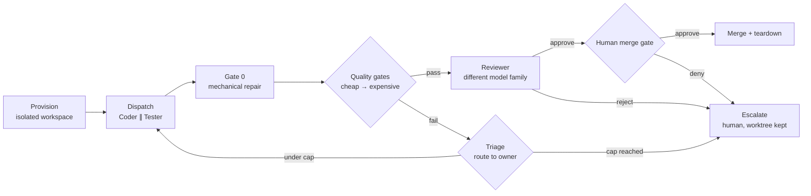

# Clojure Agent Kit

*An opinionated, reusable build method — not a domain, not a specific project.*

A gate-driven way to build a Clojure application with a small team of independent AI agents — a contract-first Blueprint, an isolated dispatch loop, a living decision log, and quality gates ordered cheap-to-expensive. Scaffolded on stock [**Clojure Stack Lite**](https://github.com/abogoyavlensky/clojure-stack-lite) (HTMX, AlpineJS, TailwindCSS, SQLite/PostgreSQL), with [**XTDB v2**](https://xtdb.com) as a SQL-compatible alternative datastore.

```
     ┌───────── each stage re-plans the ones after it ─────────┐
     ▼                                                         │
    PLAN  ──▶  FOUNDATION  ──▶  STAGE 1  ──▶  STAGE 2  ──▶  STAGE 3  ──▶ …
                   │               ▲             ▲             ▲
                   └───────────────┴─────────────┴─────────────┘
                            every stage runs through it
```

**No phase is finished when the next begins.** Plan is thin at the start and re-planned after every stage; Foundation is configured once and then improves continuously underneath the stages; stages repeat. Stage names and count are yours; nothing here prescribes them.

> Distilled from a live multi-agent build that ran this loop across dozens of real dispatches — including a few it got wrong — before anyone trusted it with real work. What follows is the discipline that survived contact with those runs, not a design done on paper.

## Contents

0. [Overview](#00--overview)
1. [The phase map](#01--the-phase-map)
2. [Phase A — Plan](#02--phase-a--plan)
3. [Phase B — Foundation](#03--phase-b--foundation)
4. [Phase C — Stages](#04--phase-c--stages)
5. [Roles](#05--roles)
6. [Blueprint & task packets](#06--blueprint--task-packets)
7. [The build loop — Steps 1–5](#07--the-build-loop--steps-15)
8. [Decision log](#08--decision-log)
9. [Quality gates](#09--quality-gates)
10. [Field guide](#10--field-guide)
11. [Keep / discard](#11--keep--discard)
12. [Should you build a harness?](#12--should-you-build-a-harness)
13. [Quick start](#13--quick-start)

Fillable document stubs for a new project live in [`skeletons/`](skeletons/).

---

## 00 — Overview

### What this is, and when it's worth it

This is the method, not the domain: a way of turning a written contract into working software using several independent agents and a chain of cheap-to-expensive checks, rather than one agent writing everything and hoping.

It pays for itself when a project has enough scope to amortize setting the process up once, and a correctness bar worth a dedicated, independent verification step. For a weekend build or a single-session prototype, skip straight to a plain Coder loop plus gates plus one human review — the full role model and the decision log below are overhead you don't need yet.

### The method it applies

**Lean thinking decides *what* to build; agile practices decide *how*; the flow is Kanban.** Lean means minimising waste — validating with small experiments and retiring high-risk designs before committing to them, rather than deciding everything up front. Agile means building whatever survived that in fast cycles, with working software at every stage. Kanban means work is **pulled when capacity frees, limited by WIP, and bounded by gates rather than sprints or timeboxes**.

That discipline governs all three phases below, not just the first — the table in §01 says what it looks like in each. Read them as one method in three shapes rather than three sets of advice.

It is not a mandate for a particular tech stack beyond the scaffold recommendation in §03, and it is not a substitute for the two human checkpoints it keeps deliberately at its center. Automating everything else is the point of the rest of this document; automating those two is not.

---

## 01 — The phase map

### Three phases with different shapes

Most process documents number their phases 1–5 and imply each one ends before the next begins. That shape is wrong here, and getting it wrong is expensive: it produces a plan that ossifies, an "infrastructure phase" nobody can schedule, and a set of decisions made years before the evidence to make them exists.

| Phase | Produces | Shape | Ends when | Where |
|---|---|---|---|---|
| **A · Plan** | The MVP boundary, a ranked risk register, and the few decisions that must be made now — everything else opened as OPEN with a named owner | **As little as possible, as late as responsible** — deliberately incomplete | You can name the MVP, the top risks have experiments assigned, and nothing is ownerless | §02 |
| **B · Foundation** | The machine: scaffold, tooling, gates, dispatch loop | Build the **minimum** that lets stage 1 dispatch, then run continuously underneath every stage — it never finishes | Its readiness checklist passes **against a live run**, not a document review | §03 |
| **C · Stages** | Working, functional software — one vertical slice at a time | **Pulled, not scheduled**; repeats, and each stage re-plans the ones after it | Never, until the product is done. Each *stage* ends at a gate, not a date | §04, §07 |

### Two rules that make the shape work

**Infrastructure and operations are woven into stages, not held in a phase of their own.** Containerization lands in the first stage that ships something; performance targets are set from the first stage that measures something; production topology lands in the stage before launch. A separate "Phase 3: Infrastructure" is a slot nobody can schedule and everybody defers.

**Everything beyond the stage in progress is provisional.** Write each stage's document just before it starts. A stage map three stages deep is a statement of intent, not a plan — and it is expected to be rewritten by what the current stage teaches you. That is the point of the method, not a failure of it.

---

## 02 — Phase A — Plan

### Decide as little as possible

The output of this phase is not a finished plan. It is the smallest set of decisions that lets Foundation start, plus an honest register of everything you have deliberately *not* decided — each with the stage that will own it.

Be honest about what this looks like in practice: the source project did write a substantial requirements and architecture set up front, and the documents below are real. But most of what was *in* them was marked PROVISIONAL with a gating spike, or OPEN with a named owning stage. The lean move is not writing fewer documents — you still need somewhere to put what you know. It is **committing to less of what is in them**, and being explicit about which parts are commitments and which are working assumptions.

The failure this prevents: a RESOLVED decision made in month one, on no evidence, that everything downstream then treats as settled.

### The MVP boundary is scoping

**MVP is the smallest *shippable* feature set that delivers real value to a user.** It is a scope decision, and scope is all it is — what goes in the first release and what waits for the next. Write three lists together and keep them together:

- **MVP** — what ships first, by requirement ID.
- **Post-MVP** — deferred, each with the reason it can wait.
- **Non-goals** — what this product is never going to be, so nobody re-litigates it in stage 3.

All three live together in the requirements document (§10 of the skeleton), because they are one product decision rather than three engineering ones — and because a deferral and an exclusion look identical six months later unless you wrote down which you meant.

### De-risking is a separate activity, and it never stops

Prototyping to prove a design is **not** the same thing as scoping an MVP, and collapsing the two is a common and expensive mistake. A spike proves a design; an MVP ships a product. Confuse them and you get either a prototype nobody can ship, or an MVP built on a design nobody proved.

So keep them apart. Prototype early, and prototype **whenever the design or the architecture changes** — not only at the start:

- **Before committing to any high-risk design choice**, in Phase A or later.
- **During MVP**, when the slice you are building first meets a store, a format, or a scale you have not tried.
- **During post-MVP**, on exactly the same terms — a post-MVP feature that needs a new datastore is as risky as an MVP one that does.
- **Especially at any design or architectural change**, where the spike is only half the work. The other half is the impact analysis in §08.

What makes a spike a spike rather than a poke around — an owning stage, a pass criterion written before it runs, a pre-documented fallback — is in §04.

### Rank risks, then order the stages by them

List what could kill the project — technology that might not scale, an integration that might not exist, a constraint you have assumed rather than checked — and rank them. Then **order the stages by the risk each one retires**, not by dependency convenience and not by what is easiest to build first.

The tech stack and the architecture are the early priority, because they are the expensive things to be wrong about: a wrong store choice discovered in stage 4 is a rewrite, and the same choice discovered in stage 1 is a config change behind a protocol. This is why the first stage should be a thin, full-depth vertical slice (§04) — it is the cheapest structure that touches every risky seam at once.

Each top risk gets an experiment cheap enough to be worth running and specific enough to fail.

The ordering is itself provisional, and that is not a contradiction of §01: you rank the risks you can see now, and re-rank after every stage, because retiring one risk routinely reveals or reprices the next. What you are committing to is the *next* stage, not the sequence.

### The document set

Six or seven documents, each with a **different change cadence** — that separation is what stops the architecture prose from either ossifying or thrashing.

| Document | Content | Cadence |
|---|---|---|
| `00-overview.md` | Mission, governing decisions, the document map, the stage map | Updated at stage boundaries |
| `01-requirements.md` | Users, use cases, functional + non-functional requirements, constraints, assumptions, non-goals, **MVP / post-MVP scope**, success criteria | Slow-moving, but not frozen — the scope split shifts as stages teach you; revise via review |
| `02-architecture.md` | Layers, storage, versioning, cross-cutting concerns; provisional parts marked, decisions referenced **by ID** | Evolves; churn lives in the log, not here |
| `02a-<domain>-model.md` | The canonical data model, if your domain has one worth its own document | Evolves stage-by-stage as adapters land |
| `03-method-and-tooling.md` | This method, instantiated: your roles, model picks, gates, scaffold, harness | Stable once ready; runs under every stage |
| `04-decision-log.md` | **Every** decision, with status and owner (§08) | **Living** — the mechanism by which everything else evolves |
| `stages/stage-N-*.md` | One document per stage: goal, scope, task list, exit criteria (§04) | Created **just-in-time**, when the stage begins |

Two things are worth stating explicitly at the top of `00-overview.md`, because leaving them implicit is what produces the contradictions the review pass below catches: the handful of **governing decisions** that everything else assumes (methodology, primary stack, macro-architecture), and the **working agreements** — above all, that decision IDs are permanent and that no code merges outside the workflow.

### Give every requirement and decision a permanent ID

Requirements (`FR-n`/`NFR-n`), architecture decisions (`D-n`), schema decisions (`S-n`), method decisions (`P0-n`), review findings (`RV-n`). Once assigned, an ID is **never reused or renumbered**, even when the thing it names is reversed. Every other document then references IDs instead of restating decisions — which is what lets the architecture doc stay readable while decisions churn underneath it.

### The plan-review pass — the cheapest gate in the whole method

Before Foundation starts, review the plan **as an artifact, adversarially, looking for gaps** — ideally with a different model or a different person from whoever wrote it. Record each finding with an ID and its resolution, and keep that table in the overview. This costs an afternoon and catches things that would otherwise surface as a rewrite three stages in.

The findings that recur, worth checking for by name:

- **Direct contradictions between documents** — two docs that disagree about a load-bearing choice (which frontend, which store), usually because one was updated and the other wasn't.
- **Status inconsistency** — something marked RESOLVED in one place and "under evaluation" in another. Downgrade it to PROVISIONAL with a named gating spike (§08).
- **Copy-paste defects** — two "different" decisions with identical body text, leaving one of them actually undefined.
- **Missing non-functional requirements.** Availability and recoverability, observability, security engineering, and accessibility are the four most commonly absent — each is the kind of thing that is cheap to state now and structural to retrofit.
- **Requirements with no execution model** — bulk or long-running operations specified as if they were synchronous request/response.
- **Deferred decisions with no owner** — "decide later" with no named stage that will decide it. Every OPEN decision gets an owner or it isn't a decision, it's a hole.
- **Compliance-scoping facts left implicit** — what the system deliberately does *not* hold or touch. Write it down as an assumption; it is load-bearing for scoping.
- **Accuracy semantics for anything approximate** — a fuzzy match, a ranking, a confidence score with no threshold and no review path for low-confidence results.
- **Broken cross-references** — a document pointing at a filename that doesn't exist.
- **Decided too much, too early** — a RESOLVED entry with no evidence behind it. That is a commitment bought before it was needed, and the review pass is the last cheap moment to downgrade it to PROVISIONAL with a gating spike, or OPEN with an owner.

**Exit criteria for Phase A:** you can name the MVP and what is deliberately post-MVP; the top risks are ranked and each has an experiment assigned to a stage; the plan survives its review and the findings table records every gap and its resolution; and every decision in the log is RESOLVED, PROVISIONAL-with-a-gate, or OPEN-with-an-owner — nothing is ownerless.

Note what is *not* on that list: a complete architecture, a full requirement set, or a stage map you believe. Those arrive as the stages teach you.

---

## 03 — Phase B — Foundation

### Infrastructure, not a stage

The workflow, the scaffold, and the gates are set up **once, before any feature work dispatches** — and then keep running underneath every stage that follows. Unlike a stage, Foundation doesn't finish; it just keeps operating. It has no slot in the delivery timeline because it isn't delivery, it's the machine delivery runs through.

### Build the minimum machine, then prove it

Foundation is where this method is most often over-built, because it is the part that feels like engineering. Resist that. **Build the smallest machine that lets stage 1 dispatch, and no more.**

- **The readiness checklist below ends with a live run** — not a design review. Validate the machine on one deliberately trivial, throwaway task before you commit to it. A design review tells you the plan looks right; only a real run tells you the machine works.
- **The dispatch mechanism starts crude on purpose.** Step 4 says a script, or a human copy-pasting packets, is enough — and §12 says the same thing about the harness: run the loop by hand until you have felt where it hurts. Automating a process you have not run automates the wrong things. This is the same lean principle you applied to the product in §02, turned on your own tooling.
- **Foundation never finishes, and that is kaizen rather than incompleteness.** It keeps improving underneath the stages as they teach you things. The field guide (§10) is the record of exactly that — every entry bought with a real run rather than designed on paper.

The failure to avoid: treating Foundation as a phase to *complete*, and building a full orchestration harness before a single feature has tested any of it. Foundation is ready when stage 1 can dispatch through it — not before, and not after.

### Step 1 — Scaffold deterministically. Do not let an LLM invent structure.

Project structure is a solved problem. Generate it from a template, commit it untouched, then adapt it — and reserve the agents for judgment work. Don't fork or hand-modify the template itself; that turns every future project back into a from-scratch decision instead of a known, diffable starting point.

```bash
# via deps-new
clojure -Ttools install-latest :lib io.github.seancorfield/deps-new :as new
clojure -Tnew create :template io.github.abogoyavlensky/clojure-stack-lite :name myproject

# or via neil
brew install babashka/brew/neil
neil new io.github.abogoyavlensky/clojure-stack-lite myproject
```

| Option | Values | Default | Picks |
|---|---|---|---|
| `:db` | `:sqlite` · `:postgres` | `:sqlite` | File-based for a solo build; Postgres once more than one person or environment touches the data |
| `:auth` | `false` · `true` | `false` | Login/registration/password-reset flow, generated for you |
| `:deploy` | `:kamal` · `:none` | `:kamal` | Zero-downtime Docker deploys via GitHub Actions; skip if you're not shipping yet |
| `:daisyui` | `false` · `true` | `false` | A component library on top of Tailwind, if you want fewer hand-styled elements |

What the stock scaffold already gives you, worth naming because each one removes a decision this method would otherwise ask you to make: **Integrant + Reitit + Ring/Jetty + Hiccup** with **HTMX 2 / Alpine 3 / Tailwind 4** for a server-rendered app that's REPL-first out of the box; **Malli** already in the dependency set, which is exactly what the Blueprint's data-shapes-first step (§06) wants to be written in; **clj-kondo, cljfmt, eftest + cloverage** already present, which are gates 1–3 of §09; and a Babashka `bb.edn` task file already set up to compose them.

Then, immediately: `git init`, and make the first commit the untouched scaffold. Everything you add is diffable against it forever.

### Step 1a — XTDB v2 as an alternative datastore

The stock scaffold's data layer is **next.jdbc + HoneySQL + Ragtime migrations** against SQLite or Postgres. XTDB v2 is a legitimate third option in that same slot, not a different architecture: it's open source, immutable and **bitemporal by default**, and it exposes a **Postgres wire-compatible endpoint** — *"XTDB provides a Postgres wire-compatible endpoint that enables developers to re-use many existing tools and drivers that have been built for connecting to real Postgres servers."*

Reach for it when you want "what did this record look like on that date" queries for free, without hand-building audit tables or bespoke versioning logic. Two ways in, and you can start with the first and keep the second as the deployment story:

```clojure
;; In-process node — ideal for tests and local dev. {} = in-memory.
(require '[xtdb.api :as xt] '[xtdb.node :as xtn])

(with-open [node (xtn/start-node {})]
  (xt/execute-tx node [[:put-docs :lists {:xt/id "l1" :title "first"}]])
  (xt/q node "SELECT _id, title FROM lists WHERE _id = 'l1'")
  ;; parameters are next.jdbc style — a vector of [sql & params]
  (xt/q node ["SELECT _id, title FROM lists FOR VALID_TIME AS OF ? WHERE _id = ?"
              (java.time.Instant/now) "l1"]))

;; Remote over pgwire — same q/tx API, config-only swap.
(xt/client {:host "localhost" :port 5432 :user "..." :dbname "xtdb"})
```

Five real deltas from the stock path, not hand-waved:

- **Migrations mostly disappear.** Ragtime assumes traditional `ALTER TABLE` DDL against a fixed schema. XTDB is schema-flexible by design — treat `resources/migrations/` as optional, not mandatory, on this path.
- **Writes need their own thin layer.** XTDB's DML has its own SQL extensions — a `RECORDS {…}` literal and an implicit `_id` primary key — that HoneySQL's standard helpers don't know. Reads look like ordinary SQL; expect to hand-write inserts and updates.
- **Clients are stateless over pgwire**, which "precludes the use of interactive transactions" — you can't run a query in the middle of a multi-statement transaction. That constrains how connection pools and transaction-scoped code are written; check it against your access patterns before committing.
- **Pin the JDK.** XTDB v2 is young and version-sensitive at the JVM level — a node that class-loads fine on one JDK can fail outright on a newer one. Pin the JDK version alongside the library version, and record both.
- **Results are keywordized** in the Clojure API (`_id` → `:xt/id`, `_valid_from` → `:xt/valid-from`), which is a small but constant translation at the seam.

> **Regardless of which store you pick:** put it behind a small protocol from the first commit — an `AppStore` or whatever your own domain calls it. That's what makes "swap the datastore later" a real option instead of a rewrite, and it costs nothing to do on day one. It is also what lets a PROVISIONAL datastore decision (§08) have a *real* fallback rather than a hoped-for one.
>
> **And for any young dependency:** keep a short `docs/api-notes/<lib>.md` recording the API you actually smoke-tested at the pinned version. Models hallucinate confidently about new libraries; a file of verified behaviour handed to an agent as context beats training recall every time.

### Step 2 — Make the REPL a first-class agent surface

Add a `dev/` path with a `user` namespace and `:nrepl` / `:test` aliases, so the REPL starts ready to work. Then install the bridge that lets *any* shell-capable agent reach it, not just the one with a fancy client — a CLI nREPL eval tool plus on-demand delimiter repair. Uniform REPL access across model families is what makes the independence rule in §05 affordable.

Run **one nREPL per workspace**, not one shared server with multiple sessions. Sessions share a JVM, so two "isolated" agents can redefine the same var. And note that an eval bridge with persistent sessions keeps vars and namespaces alive between calls — cheap for the Coder's inner loop, and exactly why the per-workspace rule matters.

> Concrete Clojure tooling for this step — the `:nrepl` alias, the **clojure-mcp-light** installs (`clj-nrepl-eval`, `clj-paren-repair`, and the zero-token repair hook), and the hook config — is in [`skeletons/03-method-and-tooling.md`](skeletons/03-method-and-tooling.md) §7.2–7.3, ready to fill in.

### Step 3 — Wire the gates as one composed task

Cheapest first, short-circuiting on the first failure (§09):

```clojure
;; bb.edn :tasks — the template supplies fmt-check / lint / test
{fmt-check  {:task (shell "cljfmt" "check")}
 lint       {:task (shell "clj-kondo" "--parallel" "--lint" "src" "test")}
 test       {:task (clojure "-X:test")}
 deps-check {:task (clojure "-M:depend")}        ; architecture boundaries
 gates      {:doc  "Quality gates, cheap first: format -> lint -> test -> boundaries"
             :task (do (run 'fmt-check) (run 'lint) (run 'test) (run 'deps-check))}}
```

Add the boundary gate **now**, with a placeholder ruleset, before you know what your real layers are. Retrofitting a boundary check onto a codebase that has been violating boundaries for three stages is a different and much worse job.

### Step 4 — Stand up a dispatch mechanism, however crude

A script, or a human copy-pasting packets. It does not need to be automated yet — see §12 before you build anything ambitious here.

### Step 5 — Run the whole loop once, end to end, on a deliberately trivial task

This is the step people skip, and it is the only one that produces evidence rather than confidence. Pick something with no design content at all — a `clamp` function — and watch the full loop run: provision, dispatch, gates, triage, review, merge. Whether it succeeds or fails, it will tell you more about your machine than any design review.

### Readiness checklist — closed against live evidence, not a document

1. **The toolchain reports green.** Every tool the loop needs is installed, reachable, and its version recorded — not assumed. [`harness-seed/`](harness-seed/)'s `bb doctor` does this and prints a version table worth pasting into the decision log; a missing small binary does not fail loudly, it quietly spends an agent's retry budget.
2. Every method decision that governs the loop — who does what, how a failure gets routed, the retry cap — is written down and closed, not necessarily perfect.
3. The scaffold *boots*: a live command starts the dev server and REPL from a clean checkout, no manual fixups.
4. Every quality gate you intend to run is green on the **untouched scaffold**, before a single feature is added.
5. The composed gate task exists and the task-dispatch mechanism exists.
6. **You have run the whole loop end to end on one trivial task**, and watched it succeed or fail informatively.

Only then does Stage 1 dispatch. Foundation is now *ready* — not done; it never becomes done.

---

## 04 — Phase C — Stages

### A stage is defined by what it retires — and what it ships

Not by a calendar slot, and not by a feature list. A stage exists to take **a named set of risks off the table and deliver a named increment of the MVP**. Both halves matter: risk-only stages produce a very well-understood product that nobody can use, and increment-only stages defer every hard question until it is expensive.

The first stage should almost always be a **thin but full-depth vertical slice**: end to end through every layer on the smallest realistic input, chosen to prove the seams and de-risk the provisional decisions rather than to demonstrate scale.

### The stage document, written just-in-time

Roughly ten sections, and the third one is the one people leave out:

1. **Goal** — one paragraph. What full-depth slice, over what input, proving what.
2. **Decisions exercised by this stage** — a table pointing into the decision log by ID.
3. **What it proves — and what it deliberately does NOT prove.** Write both columns. The "does not" column is what stops a prototype from being mistaken for a scale test, and it is where deferred work gets *tracked* rather than forgotten.
4. **Architecture — the seams.** The protocols and contracts this stage establishes. For the first stage this is the heart of the document.
5. **Data shapes** — the ones this stage introduces (this feeds the Blueprint directly, §06).
6. **Domain specifics** — whatever is peculiar to this stage's input.
7. **Tech stack for this stage** — including anything provisional.
8. **Local development environment** and, if relevant, the local → deployed portability story.
9. **Dependency-ordered task list** — the input to the Architect's Blueprint.
10. **Exit criteria** — concrete and checkable (see below).
11. **Residual risks / what feeds the next stage.**

### Spike gates: how a PROVISIONAL decision gets settled

Give each validation spike its own ID (`R1`, `R2`, …) and name, in the decision log, **which spike gates which decision**. A spike is not "we'll try it and see" — it has a stage that runs it, a pass/fail criterion written before it runs, and a pre-documented fallback that executes if it fails. Concentrating two young dependencies in one stage is itself a risk worth an ID.

### Exit criteria, and what happens when a gate fails

Write exit criteria as things a person can *check*, not qualities they can admire: "search returns results and clicking a result opens detail"; "load release two, time-travel returns release one's state, diff lists added/removed/changed"; "the boundary gate passes"; "each protocol has one implementation and a documented fallback". Add one more that is easy to forget:

> **The stage's decision-log updates are recorded** — spike outcomes noted against the decisions they gate, provisional entries confirmed or reversed.

### Flow, not timeboxes

Stages are **pulled when capacity frees, not scheduled**. There is no iteration length in this method and no timebox anywhere — a stage takes exactly as long as its exit criteria take, and the honest response to a stage running long is to look at what it is stuck on, not to declare it done at a date.

Mark which stage completes the MVP. Everything after that boundary is post-MVP by construction, which makes the question *"could we ship after this one?"* answerable at every stage boundary rather than only at the end.

Stage boundaries are **gates, not dates**. A gate can loop back: if a spike fails, the documented fallback executes behind the protocol and the stage re-runs its exit criteria. The stage loops; it does not silently pass.

---

## 05 — Roles

### Six roles, one independence rule

| Role | Responsibility | Access |
|---|---|---|
| **Orchestrator** | Dispatches tasks in dependency order; triages failures; runs the final integration check | Dispatch and triage only — never touches code |
| **Architect** | Produces the Blueprint: data shapes → interfaces → namespaces → dependency-ordered task list | Produces an artifact; no code access |
| **Coder** | REPL-first implementation, one task at a time | Full read/eval/write, in its own isolated workspace |
| **Tester** | Authors tests from the Blueprint's contract, independently of the Coder | Eval for authoring only — never runs the full suite itself |
| **Reviewer** | Judges already-green code: design, idiom, edge cases, silent behavior changes | Read-only — a diff and a gate report, nothing to write |
| **DevOps** | Judgment-level config, docs, release prep | Whatever a given task needs, scoped narrowly |

### A seventh role, off the loop

The six above are dispatched with packets and held to gates. Three kinds of work are not, and every project has all three: **building the harness itself** (which is written outside the loop it will later run, §12), **modelling and design sessions**, where the output is a decision rather than a diff, and **debugging the worktree an escalation left behind** — the loop deliberately leaves it in place (§07), and somebody has to go and look at it.

Name that role too. It is a person, or an agent working interactively beside them, and it has no packet, no retry cap and no gate discipline of its own — which is exactly why it has to inherit the *written* rules (§06). Hand-written code held to a lower bar than generated code is how a codebase ends up with two standards and one of them losing.

One rule inverts for this role: the loop's agents are told never to run the gates, because authoring and running are deliberately separate jobs. Nobody is gating this role, so it runs them itself.

### Independence, precisely

Any agent verifying another agent's output runs on a **different model family** — not merely a different model. Two models from the same vendor still share the same blind spots and can produce a false green together. The *client* matters too, not only the model: a client with hook support can run mechanical fixups the model itself never has to reason about, which is a property of the tool, not of the role.

Record the **family assignment as the binding contract** and the specific model as a dated selection underneath it. Re-selecting when vendors ship new models is then a new log entry, not an edit to an old one.

### Do you actually need a dedicated Tester?

It's a real cost — a fourth model call on every task. Worth it when the error cost is high (audited data, correctness-critical logic) or the domain has rich generative properties to test against. Skip it for lower-stakes or exploratory work, and lean on Coder-loop + gates + Reviewer instead.

Wherever tests are authored by a role, that role should never also *run* the full suite as a model step — **authoring is a model's job, running is the gate's job**, always. And Coder and Tester can both start from the same Blueprint slice and work in parallel rather than a red-green handoff, since each derives independently from the same written contract.

**Write down the property targets** the Tester is expected to hit, in the method or stage doc — they generalize better than they look:

- **Round-trip** — `parse → canonical → store → read` preserves the identifying fields.
- **Identity & disjointness** — `diff(v, v)` is empty; in `diff(v1, v2)` the added and removed sets don't overlap.
- **Transitivity** — if `A ⊑ B` and `B ⊑ C`, the derived store agrees that `A ⊑ C`.
- **Cross-surface consistency** — two paths to the same answer (an API and a query) agree on every sampled input.

---

## 06 — Blueprint & task packets

### Data shapes first — the Blueprint is also the test contract

Produce the Blueprint in a fixed order: **shapes → interfaces → namespaces and dependencies → a dependency-ordered task list.** Get the shape of the data agreed before anything is built or tested against it.

The same shapes and interfaces the Coder implements against are what the Tester derives tests from, independently. That doubling is why the Blueprint needs unusual precision — it's read twice, by two agents who never compare notes.

**A task packet's minimal shape:**

```clojure
{:task/id       "t-07-service-ops"
 :task/title    "Service ops: lookup, children/descendants, search"
 :task/role     :coder                    ; :coder | :tester | :reviewer
 :blueprint/slice
   {:shapes     [Concept Release]                    ; Malli shapes, this namespace
    :interfaces [(lookup [store cs code opts])       ; signatures to implement
                 (children [store iri])
                 (descendants [store iri opts])]
    :deps-sigs  [(query [store q opts])]}            ; upstream sigs it may CALL — never their source
 :files/target  ["src/app/service.clj"]     ; what this role may write
 :files/context ["src/app/store.clj"        ; read-only
                 "src/app/model.clj"]
 :repl/worktree "/work/app-wt-07"          ; its own isolated workspace
 :repl/port     7807                       ; its own REPL, not a shared session
 :layer/name    :service                   ; boundary gate: may depend on #{:store :model}
 :gates         {:retry-cap 3}}
```

> This block is `harness-seed/src/harness/shapes.clj`'s `example-packet`, and `bb test` in that directory validates it against the schema. If the two ever disagree, the code is right.

The trick worth keeping is `:deps-sigs`: upstream namespaces are handed over as *call signatures only*, never as implementation source. That keeps a task's context small and makes it mechanically impossible for it to reach into an upstream implementation detail it was never given.

### Per-role deltas from the same base packet

- **Coder** — target is the impl file(s); context is the read-only dependency files.
- **Tester** — target is the test namespace; context *excludes the Coder's own impl file even if listed*. Enforce this mechanically, in whatever assembles the packet — not as author discipline, which erodes.
- **Reviewer** — no target file at all. It receives a diff, the contract slice, and the green gate report — nothing to write.

> **The key invariant:** the Tester reads the *contract*, never the *code*. Tests derived from an implementation only re-assert what the code already does; tests derived from the shapes catch where the code and the contract disagree.

Also worth writing into the Blueprint explicitly: a **§0 of human prep** — anything a task depends on that no agent can do (an account, a licensed data download, a signed agreement, a machine with a GPU). These are not task packets and they block dispatch; naming them up front is cheaper than discovering them at attempt one.

### The rule source — where a convention actually lives

The packet carries what is true of *one task*. Conventions are true of *every* task, and the field guide's second entry (§10) is emphatic that stating them up front beats letting retries teach them. That raises a question the packet does not answer: where does a convention live?

**In one file, rendered outward.** Keep them in a *rule source*: the single authoritative set of rule records — records, not prose, and not a body of text for training. Each carries a stable id, a group, the rule text, and an **audience** naming which agents it is for.

Everything else that holds rules is a *rendering* of that source: each headless agent's system prompt, filtered by audience and with per-dispatch values substituted, and the agent-facing rules file at your repo root. A gate fails the build when a rendering drifts.

The failure it prevents is mundane and certain: the same rule written in the Coder's prompt, the Tester's prompt, and a rules file, drifting apart one edit at a time, with nothing to notice.

### Three layers, and which one wins

Rules reach an agent from three places, and they **merge silently**:

| Layer | Holds | Reaches |
|---|---|---|
| Personal / global rules file | One person's taste, across every project they touch | Only clients that read that file |
| Project rules file at the repo root | This project's rules, in a generated block — the rest of the file is hand-written | Only clients that read that file |
| The rule source, rendered into the system prompt | Anything a gate enforces | **Every model family** |

Two facts decide how you use them. First, **a rules file is specific to one vendor's client** — and §05 requires the agent verifying the Coder to be a *different family*, which reads no such file at all. The prompt is the only universal channel. Second, **layers merge**, so a personal preference can contradict a project non-negotiable without either side knowing.

That collision is not hypothetical. A perfectly reasonable personal rule — *"run the tests after modifying a namespace"* — sits directly against this method's most load-bearing rule: *never run the gates yourself; authoring is the model's job, running is the gate's* (§05). Obeying the wrong one breaks the separation the whole loop is built on, and nothing in either file mentions the other.

So: personal taste that travels between projects goes in the global file. **Anything a gate enforces must be in the rule source**, because a file you do not control can contradict a file you do. And have the rule source state its own precedence as a rule, so whichever channel an agent reads, it is told which layer wins — that is the only mitigation available, since nothing stops the merge itself.

**Adding something by hand.** Only the generated block is generated; the rest of that file is yours and survives every sync. So the question is which bucket you are in: *a rule for agents* goes in the rule source — which is still hand-writing it, just in the source rather than a rendering; *a rule only humans need* goes in the rule source too, marked human-only, which renders to the file and reaches no prompt; *anything that is not a rule* — orientation, a task-surface table, pointers to docs — is hand-written outside the markers. The test is whether a headless agent on another model family would need it.

What must never happen is a **rule** written outside the markers. It survives every sync, so nothing complains — and it reaches only the clients that read that file, which by the independence rule above excludes your verifier. Silent, and precisely the failure this arrangement exists to prevent.

> A working implementation — the rule source, both renderings, the marker-block sync and the drift gate — is in [`harness-seed/`](harness-seed/); `harness-seed/CLAUDE.md` is its own output.

---

## 07 — The build loop — Steps 1–5

How one unit of work moves from a requirement to merged code. Steps 1 and 2 are per-project and per-stage; Steps 3–5 repeat per task.

### The dispatch loop is the board

The dependency-ordered task list is a queue and the loop is a Kanban board, so the board's disciplines apply directly to the five steps below:

- **Limit WIP, and start the limit at one task in flight.** One *task*, not one agent — Step 3 dispatches that task's Coder and Tester in parallel, and they are one unit of work rather than two. Concurrency across tasks is what to hold back: two simultaneous failures are considerably more than twice as hard to diagnose as one, because they interleave in the logs and each makes the other look like its cause. The source project's harness shipped sequential scheduling deliberately, with parallel dispatch as a fast-follow it had not needed yet.
- **Blocked work stays visible.** This is why an escalation leaves its workspace in place instead of tearing it down: a blocked item that disappears from the board stops being anybody's problem.
- **The gates and the retry cap are explicit policies** in the Kanban sense — written down, applied uniformly to every task, and changed deliberately rather than case by case. That is exactly what makes them safe to automate.

### Step 1 · Environment (Human + DevOps) — once, in Foundation

Covered in §03. **Exit:** the REPL starts and the test alias runs from a clean checkout.

### Step 2 · Strategic planning (Orchestrator + Architect) — once per stage

The Orchestrator hands the stage document to the Architect, who produces the Blueprint in the §06 order. The Orchestrator reviews it first: **if it is over-engineered, it goes back to the Architect to simplify before any code is written.** Then the human signs off.

**🚦 Human gate #1.** This is the cheapest point in the entire method to catch a wrong direction.

**Exit:** an approved, dependency-ordered Blueprint with explicit data shapes.

### Step 3 · Dispatch & REPL-driven implementation (Coder ∥ Tester)

Dispatch each task **in dependency order** to a Coder and Tester **concurrently**, each with an isolated workspace. They share the Blueprint slice; they do not share each other's output.

The Coder works the idiomatic inner loop: prototype the approach in the REPL to confirm the design holds *before* writing the namespace, then write a form → eval → read → refine, and persist to file only once the forms behave. Most bugs die here, in milliseconds, before any other role is involved.

The Tester authors example-based tests for the specified behaviours and property-based tests for the invariants the shapes imply, prototyping generators in the REPL — and does **not** run the suite as its deliverable.

**Exit:** the namespace evals cleanly **and** its test namespace is authored.

### Step 4 · The quality loop — cheap gates, then review



1. **Provision** — an isolated workspace and eval environment per task. Give each concurrently-dispatched task its own process, not a session shared with other in-flight tasks; shared session state between "simultaneous" tasks is a silent contamination source.
2. **Gate 0** — a pre-gate, not a gate: whatever's purely mechanical and fully automatable (formatting-on-write, delimiter repair) runs here, before it can consume an agent's capped retry budget.
3. **Gates** — ordered cheap to expensive, each short-circuiting on first failure (§09). A failing gate's log goes straight back to the owning agent; **no Reviewer involvement yet.** Don't pay a frontier model to look at code that doesn't compile.
4. **Triage** — route a failure to the role that *owns* it: an implementation bug to the Coder, a design flaw to the Architect, a defective test to the Tester — not reflexively back to whoever wrote last. Default ownership of a failing test is the Coder (make it green); if the Coder judges the *test* mis-encodes the contract, that is a triage decision, not the Coder's to make alone.
5. **Review** — only on green gates, by the independent-family Reviewer, focused on what tools can't catch: design, idiom, logic, naming, edge cases. Edge cases it surfaces return to the Tester as new cases and to the Coder for the fix.

**Exit:** formatted, lint-clean, independently-authored tests green, boundaries green, Reviewer approved.

> **The circuit breaker.** Every loop gets a hard retry cap; hitting it escalates to a human rather than retrying forever. The number is arbitrary per project — the discipline isn't. And escalate means *hand off what's there*, not discard it: if an agent had already produced usable output before the cap fired, let the gates judge it. A cap that fires with nothing produced is still an unambiguous failure.

### Step 5 · Integration & finalization (Orchestrator + Human)

Once all tasks are verified: a full test run plus **slice-level integration tests authored across task boundaries** to exercise the whole vertical slice; DevOps updates documentation and prepares the release.

**🚦 Human gate #2.** Commits, merges, and releases are irreversible side effects — keep a person on the trigger. On approval, merge and tear the workspace down. On escalation or a denied merge, **leave the workspace in place** for inspection.

Keep exactly **two** human checkpoints across the whole loop, and resist adding a third. A human gate's value is roughly inverse to how often it fires.

---

## 08 — Decision log

### Separate what you believe from how you got there

Without this split, an architecture doc either ossifies (never updated to reflect reality) or thrashes (rewritten every time something changes). A living decision log takes the churn so the architecture prose doesn't have to. **This is the mechanism that reconciles an agile, stage-by-stage method with a coherent written architecture** — without it you have to choose one.

### Three statuses. Only three.

`RESOLVED` · `PROVISIONAL` · `OPEN`

- **Resolved** — decided. Reversing it later is a *new* decision, not an edit to this one.
- **Provisional** — the working choice, naming which spike or stage gates it, with the fallback path *pre-documented* — decided now, not invented later under pressure.
- **Open** — undecided, with an explicit owner: the future stage that will decide it. Never leave a decision ownerless.

### ID families, never renumbered

Group decisions by kind — architecture, method & tooling, schema, governance, review, whatever your project actually needs — and once an ID is assigned, it is never reused or renumbered, even when the decision it names is reversed. Traceability depends on this.

### Amendment procedure

1. Anyone may propose a change, citing the evidence (a spike result, a stage learning).
2. Status transitions are recorded *in place* — the row is updated, the old resolution noted, never deleted. An **amendment note dated inside the row** is the right shape: *"Amended 2026-07-13: the embeddable line is dead; evaluate over HTTP behind the unchanged protocol — the rest stands."*
3. Reversing a Provisional decision triggers its pre-named fallback.
4. Any other doc a decision materially touches gets updated in the same change.

**Starter skeleton:**

```markdown
# Project Decision Log

# Resolved — decided; reversal is a new decision
# Provisional — working choice; gated by a named spike; fallback pre-documented
# Open — undecided; owned by a named future stage

## Architecture (D)
| # | Decision | Options considered | Status / Resolution |
|---|---|---|---|
| D1 | … | … | OPEN — owner: <stage> |

## Method & tooling (P0)
| # | Decision | Options considered | Status / Resolution |
|---|---|---|---|
| P0-1 | Datastore | sqlite · postgres · xtdb-v2 | … |
```

### An architectural change triggers an impact analysis

The amendment procedure above is the paperwork. For anything architectural, there is thinking that has to precede it.

**Trigger:** an architecture-family decision is added mid-flight, reversed, or materially amended. Flag it and run the analysis **before** committing to the change — not alongside it, and not after the code lands.

**What the analysis has to cover:**

- **Requirements it touches** — including ones already marked satisfied, which are the easiest to miss precisely because they are closed.
- **Other decisions that depend on it, by ID.** A reversal cascades, and permanent IDs are what make the cascade traceable at all.
- **Already-built stages** — which code, seams and protocols are affected, and whether the change is mechanical behind an existing protocol or a rewrite. If you put the seams in early (§03), this is the question they were put there to answer.
- **Data already stored** — the migration, if any, and whether it is reversible.
- **Tests that encode the old assumption.** They keep passing while being wrong, which is the failure mode nobody notices.
- **Whether the pre-documented fallback is still real**, or has quietly rotted while unused. A fallback nobody has exercised in six months is a hypothesis, not a plan.

Record the analysis alongside the decision.

> **This matters more in an agent-driven loop, not less.** An agent is handed a deliberately narrow slice — signatures for its dependencies, never their source (§06) — and that narrowness is exactly what makes the loop work. It also means the agent is structurally incapable of seeing the blast radius of the change it is making. The analysis is therefore the Architect's job or a human's, never the Coder's, and no amount of prompting moves it.


---

## 09 — Quality gates

### Cheap before expensive, ordered so each one earns its keep

Order the pipeline so free, deterministic checks run first and stop the line — an expensive step (a frontier-model review) should only ever run against code that already passed everything a machine can check for free.

| Gate | Catches | Universal? |
|---|---|---|
| 0 · Mechanical repair | Purely mechanical fixups no agent's retry budget should ever pay for | Pattern universal; tool is stack-specific |
| 1 · Format | Whitespace and style consistency | Universal — any formatter |
| 2 · Lint | Style *and* correctness smells, **fail on warning** | Universal pattern; the strictness is deliberate |
| 3 · Tests | Behavior against the contract, authored independently | Universal — the independence is the practice |
| 4 · Boundaries | Illegal dependencies between your own layers | Need is universal; the rules are 100% yours |
| 5 · Model review | Design/idiom/logic no machine gate catches | Universal |

This ordering is **waste elimination**, in the lean sense (§00): rework is caught at the cheapest point that can catch it, and an expensive judgement is never spent on something a free check would have found. A well-placed gate 0 makes the next gate *nearly a no-op* — design for that compounding effect rather than treating each gate as independent.

> **Gate 0 can also corrupt code, and you should know how.** A repair step that rewrites what an agent wrote is only safe on input it can read correctly. A bracket balancer handed a badly-indented multi-line form will close brackets in the *wrong* place — and then gate 0 has silently turned working code into something nobody wrote, before any gate that could have caught it runs. The mitigation is not to weaken gate 0; it is a formatting rule in the rule source (§06), so agents produce input the repair can read. Gates and rules are one system, not two: this gate is safe *because* that rule exists. And fail-on-warning, not just fail-on-error, is a deliberate strictness choice: it's the thing that keeps a weaker or cheaper model on the loop honest, because the gate won't let sloppy-but-passing output through.

Run the gates in the **already-warm REPL** where you can, rather than paying a cold JVM start per attempt. In a loop that retries, that cost is paid over and over.

---

## 10 — Field guide

### Learned live, not designed on paper

Ten things that only showed up from running the loop repeatedly against real work — each one cost a real run to learn.

1. **Profile by call frequency, not per-call cost — then fix the constraint, and only the constraint.** The role that fires on *every* task, however cheap-sounding, is usually the loop's real clock. Measure it: cycle time per task falls out of the run log's timestamps for free, once you are recording them (items 5 and 9). In the source project the Tester was **over 80% of wall time on every completed run**; attacking that one role took total wall from **18:04 to 2:06** across five runs. Optimising anywhere else would have moved nothing, and the arithmetic says so before you start.
2. **State conventions as rules; don't wait for retries to teach them.** A less-than-frontier model learns a written rule instantly and a scolding slowly. Three rounds of gate feedback failed to break a habit that one up-front line in the system prompt broke immediately. Each retry round is a full paid attempt. Rules that load-bearing deserve somewhere better than a prompt string — put them in a rule source (§06).
3. **A new rule is a new way to be wrong.** An instruction meant as a hint can be satisfied literally, in a way that breaks something else entirely. Test a prompt change against a live run, the same way you'd test a code change.
4. **A capped loop should hand off its work, not discard it.** The first time a circuit breaker fires on real, salvageable output, "the cap tripped, so throw it all away" is the wrong default. Let the gates decide whether the output was any good.
5. **Log which agent, model, and *serving provider* served every call, from day one.** Wherever a horizontal swap is possible, the incident that needs this data to diagnose always arrives before you get around to adding the logging otherwise — and behind a single model name there may be several providers with visibly different behaviour.
6. **Fail-on-warning does real, positive work.** Treat it as a design choice, not friction to loosen the first time it's inconvenient — it's what forces clean output instead of merely passing output.
7. **A resumed retry can cost several times a fresh attempt.** If your retry mechanism carries full prior session history, that cost curve should set your retry cap — not an arbitrary number picked before you'd measured anything.
8. **Tool-call failures return to the model as data, never crash the process.** An uncaught exception from one bad tool call losing an entire in-flight, already-paid-for run is cheap to close and expensive to discover live.
9. **Record what a gate actually said, not just which gate failed.** "Which gate" alone isn't enough for anyone — human or model — doing triage after the fact.
10. **Serving parameters are part of the artifact — pin them.** Sampling settings, and for locally-served models the chat template itself, change failure *quality*, not just speed. A community-packaged model's embedded template broke tool-call parsing outright and silently corrupted arguments; the fix was to pin the official one in-repo. Version-control anything that shapes model output.

**Triage is worth a model call.** A deterministic heuristic has to assume something — usually that the tests are right and the implementation is wrong. A model that reads the failing gate output against the contract *and* both agents' files can tell the difference between a faithful implementation and a test whose generator violates the contract's own preconditions. Put it behind the deterministic path as a seam, so it can **degrade, never block**.

---

## 11 — Keep / discard

### What generalizes from the source build, and what doesn't

**Keep:**
- Generate the scaffold once, then adapt it — never fork the template itself.
- The composed gate task, cheapest check first.
- A protocol seam around your datastore from the first commit.
- A placeholder architecture-boundary rule, and the gate that enforces it, before you even know your real layers.
- Committing immediately after generation, so you can always diff "what the template gave me" from "what I added."
- Verified API notes for any young dependency, handed to agents as context.
- The three-status decision log and permanent IDs.

**Discard:**
- Any specific datastore *pairing* — a two-store split exists to satisfy an unusual, specific combination of requirements; most projects need one store, chosen for their own reasons.
- Literal protocol or namespace names — name your own seams after your own bounded contexts, decided the same way (shapes first), never copy-pasted.
- Any specific model or vendor pick for a role — these are point-in-time choices; re-decide them fresh, following the independence rule, not the specific names.
- The specific retry cap, and the specific stage count and names.
- All domain content.

---

## 12 — Should you build a harness?

This document gives you the method, a decision-log discipline, and a task-packet shape. It does not hand you a harness — the thing that provisions workspaces, dispatches agents, runs gates, and triages failures was a substantial piece of software in its own right in the source project, built once, **outside the loop it would later run**.

**Recommendation: don't build it speculatively.** Run the loop by hand for the first several tasks — copy the Blueprint slice into each agent's prompt yourself, run the gates yourself — and automate the orchestration only once you've felt where the manual version actually hurts. Automating a process you haven't run yet tends to automate the wrong things.

When you do get there, [`harness-seed/`](harness-seed/) is a working starting point rather than a blank page — about 500 lines, extracted from a harness that ran this loop across dozens of real dispatches:

- §06's **task packet** as real Malli schemas, and the assembler that strips the Coder's implementation from the Tester's context *mechanically*;
- the **gate runner** — ordered, short-circuiting, returning what a gate said rather than only which one failed;
- **gate 0**, in its own namespace, so the stack-specific repairs have exactly one home;
- the **`AgentRunner` seam** with a `ManualRunner` that gets the mechanics working end-to-end on day one, plus a **conformance check** to run every headless runner you add through;
- a **toolchain doctor** (`bb doctor`) reporting every tool the loop needs, its version, and what it is for — which is how Foundation readiness criterion 1 becomes something you run rather than something you assert.

`bb doctor && bb gates && bb example` runs green with no model calls, no network, and no checkout but its own. It is meant to be **copied and edited, not depended on**; its README says what was deliberately left out and why, and `PROVENANCE.md` says where it came from and how it has since diverged.

**The rest of the build list, in dependency order, once the seed is in place:** workspace and REPL provisioning; triage with a capped retry; the first headless runner, then the others; an append-only run log; and the two human pause points.

Two things to get right early because they're cheap now and expensive later: **auto-approving an agent's edits is only safe because it runs in an isolated workspace** — never the main checkout; and the **run log is the only artifact that survives a run**, so record task, attempts, status, cost, provider, and the failing gate's actual output.

---

## 13 — Quick start

**Phase A — Plan** *(decide as little as possible)*
- [ ] Name the **MVP** — the smallest shippable feature set — and what is deliberately post-MVP
- [ ] Rank the risks; give each top one an experiment cheap enough to run and specific enough to fail
- [ ] Order the stages by the risk each retires, not by what is easiest to build
- [ ] Decide only what blocks starting; open the log with everything else PROVISIONAL-with-a-gate or OPEN-with-an-owner
- [ ] Assign ID families; make "IDs are permanent" a written working agreement
- [ ] Run the adversarial plan review (§02) — including "did we decide too much, too early?"
- [ ] Confirm no decision is ownerless

**Phase B — Foundation** *(build the minimum machine, then prove it)*
- [ ] Generate the scaffold — `neil new io.github.abogoyavlensky/clojure-stack-lite <name> :db <sqlite|postgres> :auth <true|false>`
- [ ] `git init` immediately; commit the untouched scaffold as its own commit
- [ ] Choosing XTDB v2 instead? Pin the library *and* the JDK, decide whether migrations are needed, write the thin SQL write layer, and check the stateless-transaction constraint against your access patterns
- [ ] Put the datastore behind a protocol before writing the first feature
- [ ] Install the REPL bridge; one REPL per workspace
- [ ] Wire the cheap-to-expensive gate order; make lint fail on warnings; add the boundary gate with a placeholder ruleset
- [ ] Decide, honestly, whether this project's stakes justify a dedicated Tester
- [ ] Decide your retry cap, and what "escalate" does with partial output
- [ ] Name your two human gates; resist adding a third
- [ ] Pin your tool versions (`.mise.toml`) and confirm `bb doctor` verifies them
- [ ] Run the loop by hand, end to end, on one trivial task — before automating any of it

**Phase C — Stages** *(pull, don't schedule)*
- [ ] Write the stage doc just-in-time, including the "does NOT prove" column
- [ ] Set a WIP limit — start at one task in flight
- [ ] Mark which stage completes the MVP
- [ ] Name the spikes, their pass criteria, and their fallbacks — before running them
- [ ] Get the Blueprint signed off (human gate #1); dispatch in dependency order
- [ ] Close the stage on exit criteria *and* recorded decision-log updates, not on a date

---

*Clojure Agent Kit — a process document. Adapt the vocabulary to your own project; keep the discipline.*
