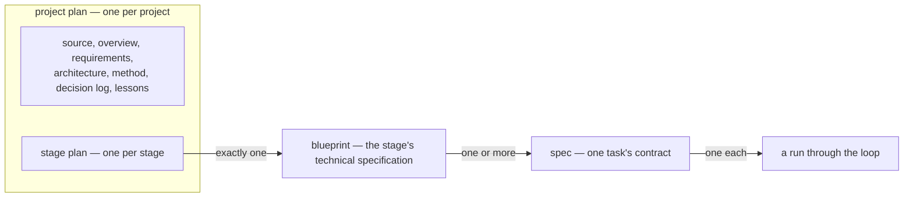
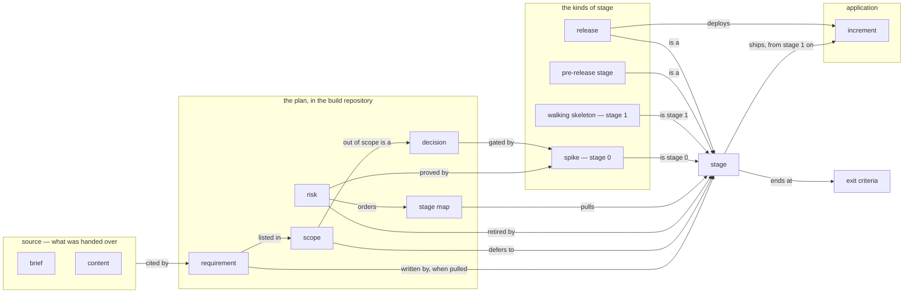
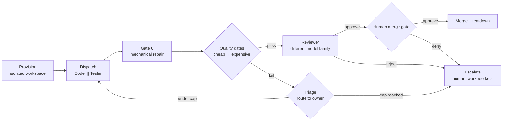

# Clojure Agent Kit (aka "KIT")

*An opinionated, reusable build method — not a domain, not a specific project.*

A gate-driven way to build a Clojure application with a small team of independent AI agents — a contract-first blueprint, an isolated dispatch loop, a living decision log, and quality gates ordered cheap-to-expensive. Scaffolded on the KIT's pinned fork of [**Clojure Stack Lite**](https://github.com/ontopro/clojure-stack-lite) (HTMX, AlpineJS, TailwindCSS, SQLite/PostgreSQL; upstream is [abogoyavlensky's](https://github.com/abogoyavlensky/clojure-stack-lite), MIT), with [**XTDB v2**](https://xtdb.com) as a SQL-compatible alternative datastore.

```
stage 0      the spike          scope ▶ plan ▶ FOUNDATION ▶ implement ▶ deploy locally
                                scope is the scoping conversation; plan is the risks ranked,
                                the candidate architecture, the pass criteria; what it owes is
                                decisions confirmed or reversed, and running software - code
                                kept only where it passed its criterion

stage 1      walking skeleton   scope ▶ plan ▶ implement ▶ deploy locally
                                one small function end to end through every layer; the first
                                owner's walk

stages 2..N  increments         ┌ scope ▶ plan ▶ implement ▶ deploy locally ┐ ──▶ the next
                                └──────────────────────────────────────────┘
                                Foundation runs under every stage from stage 0

pre-release  one stage or more  what release needs and nothing earlier: host, publish, backup,
                                restore, metrics, logging, auditing, the pre-publish gate

release                         package ▶ deploy on the server, or publish for download
                                then back to the next increment; a later release has a smaller
                                pre-release before it
```

**Every stage has the same four steps, and no phase is finished when the next begins.** The plan is thin at the start - it commits to stage 0 and nothing after it - and is revised at every stage's end; Foundation is built in stage 0 and then improves continuously underneath the stages; stages repeat until the product is released, and release repeats. Stages are numbered through, and each has a kind: spike, skeleton, increment, pre-release, release. The names are yours; the kinds and their order are the method's.

> Distilled from a live multi-agent build that ran this loop across dozens of real dispatches — including a few it got wrong — before anyone trusted it with real work. What follows is the discipline that survived contact with those runs, not a design done on paper.

## Contents

0. [Overview](#00--overview)
1. [The phase map](#01--the-phase-map)
2. [Phase A — Plan](#02--phase-a--plan)
3. [Phase B — Foundation](#03--phase-b--foundation)
4. [Phase C — Stages](#04--phase-c--stages)
5. [Roles](#05--roles)
6. [Blueprint & task packets](#06--blueprint--task-packets)
7. [The build loop — Steps 1–5](#07--the-build-loop--steps-15)
8. [Decision log](#08--decision-log)
9. [Quality gates](#09--quality-gates)
10. [Field guide](#10--field-guide)
11. [Keep / discard](#11--keep--discard)
12. [Should you build a harness?](#12--should-you-build-a-harness)
13. [Quick start](#13--quick-start)

Fillable document stubs for a new project live in [`plan-template/`](plan-template/).

---

## 00 — Overview

### What this is, and when it's worth it

This is the method, not the domain: a way of turning a written contract into working software using several independent agents and a chain of cheap-to-expensive checks, rather than one agent writing everything and hoping.

It pays for itself when a project has enough scope to amortize setting the process up once, and a correctness bar worth a dedicated, independent verification step. For a weekend build or a single-session prototype, skip straight to a plain Coder loop plus gates plus one human review — the full role model and the decision log below are overhead you don't need yet.

### The method it applies

**Lean thinking decides *what* to build; agile practices decide *how*; the flow is Kanban.** Lean means minimising waste — validating with small experiments and retiring high-risk designs before committing to them, rather than deciding everything up front. Agile means building whatever survived that in fast cycles, with working software at every stage. Kanban means work is **pulled when capacity frees, limited by WIP, and bounded by gates rather than sprints or timeboxes**.

That discipline governs all three phases below, not just the first — the table in §01 says what it looks like in each. Read them as one method in three shapes rather than three sets of advice.

It is not a mandate for a particular tech stack beyond the scaffold recommendation in §03, and it is not a substitute for the two human checkpoints it keeps deliberately at its center. Automating everything else is the point of the rest of this document; automating those two is not.

---

## 01 — The phase map

### Three phases with different shapes

Most process documents number their phases 1–5 and imply each one ends before the next begins. That shape is wrong here, and getting it wrong is expensive: it produces a plan that ossifies, an "infrastructure phase" nobody can schedule, and a set of decisions made years before the evidence to make them exists.

| Phase | Produces | Shape | Ends when | Where |
|---|---|---|---|---|
| **A · Plan** | The brief and the scope, a ranked risk register, the candidate architecture as provisional decisions each with the pass criterion stage 0 will apply, and a stage map by kind — everything else opened as OPEN with a named owner | **As little as possible, as late as responsible** — it commits to stage 0 and nothing after it | The top risks are ranked and stage 0 names which it proves, nothing is ownerless, and stage 0 is approved with its cap | §02 |
| **B · Foundation** | The machine: scaffold, tooling, gates, dispatch loop — built inside stage 0 | Build the **minimum** that lets stage 0's packets dispatch, then run continuously underneath every stage — it never finishes | Its readiness checklist passes **against a live run**, not a document review | §03 |
| **C · Stages** | Working, functional software — stage 0 a spike, stage 1 a walking skeleton, then increments, pre-release stages and release | **Pulled, not scheduled**; repeats, and each stage's end revises the scope, the stage map and the next stage's requirements | Never, until the product is released — and release repeats. Each *stage* ends at a gate, not a date | §04, §07 |

### The words

The method uses a small vocabulary and means one thing by each word. A reader who knows Scrum or Kanban will find their counterparts in §04.

| Word | Means |
|---|---|
| **brief** | the person's one-page ask, in their words: who it is for, what it shows or does, what material exists, what must be proved early, the first thing worth seeing, the money (§02, step 0) |
| **source** | what was handed over, recorded in `source.md` and numbered so that a requirement can cite the observation it rests on |
| **content** | the part of the source the product shows, named apart from the rest — a site has content, a library has none |
| **requirement** | one thing the product must do or be, with a permanent ID; written when the stage that builds it is pulled, never earlier |
| **scope** | three lists kept together: what ships first; what is deferred, with the reason and the stage that will take it; what is out of scope, with the reason. An exclusion is a decision with an ID, reversed only by a later decision that cites it — never reargued in passing and never sealed. The lists are revised at every stage's end |
| **risk** | what could kill the project — a technology that may not scale, an integration that may not exist, a constraint assumed and not checked; ranked, and the stages ordered by it |
| **decision** | one thing settled, with a permanent ID, its status and its owner, in the decision log (§08); provisional until the spike that gates it runs; reversed only by a later decision that cites it |
| **stage map** | the candidate stages in the order the risks put them, each with its kind; only the stage in progress has a cap; re-ranked after every stage |
| **stage** | a unit of scope with a gate at its end: defined by what risk it retires and what it ships; pulled when the previous one closes; never a unit of time. Numbered through, each with a kind |
| **project plan** | the document set in the build repository — the source, the overview, the requirements, the architecture, the method as instantiated, the decision log, the lessons, and one stage plan per stage. What and why, for people, with permanent IDs. "The plan" is its short form, in the commands and the template folder too |
| **stage plan** | the project plan's slice for one stage, written when the stage is pulled: its goal and kind, the requirements it adds, the decisions it exercises, what it proves and does not, its seams, its task list, its exit criteria and its cap. Approved by the person before the blueprint is cut from it (§04) |
| **blueprint** | the stage's technical specification, written by the Architect from the stage plan: the data shapes, the signatures, the namespaces, the task packets in dependency order — how, precisely enough for two agents who never compare notes (§06). Exactly one per stage, read by the blueprint review and signed off by the person |
| **spec** | one task's contract, a packet cut from the blueprint: the targets, the shapes inlined, the signatures checked against the source they name. What one Coder and one Tester receive, read cold by the spec review before dispatch; one or more per stage (§06, §07) |
| **spike** | a proof of one or more risks, with a pass criterion written before it runs and a fallback written beside it; what it owes is decisions confirmed or reversed, not code. Stage 0 is a spike |
| **walking skeleton** | stage 1: one small function end to end through every layer the architecture names, built on what stage 0 settled and keeping stage 0's code only where it passed; the first thing the owner walks |
| **increment** | what a stage from 1 on ships into the application; stages 2 to N are increments; the first increment a person could ship is what the first release carries |
| **pre-release stage** | what release needs and nothing a user-visible stage needed earlier: host, publish, backup, restore, metrics, logging, auditing, the pre-publish gate — one stage or several, each with its own gate |
| **release** | package, then deploy on the server or publish for download; after any stage whose increment is shippable, and again after later stages with a smaller pre-release before it |
| **exit criteria** | a stage's definition of done: things a person can check, the owner's walk and the decision-log update among them; from stage 1 on, *deployed locally* is one of them |
| **build** | the repository beside the application that holds the plan, the build's settings and its records |
| **application** | the repository of the code; what an increment lands in |

**The three levels** — project plan, blueprint, spec — are each cut from the one above, and their counts are fixed:

| | Per project | Per stage, including stage 0 and the pre-release stages | Per task |
|---|---|---|---|
| **project plan** | one, the document set | one stage plan, the plan's slice for the stage | |
| **blueprint** | | exactly one, cut from the stage plan | |
| **spec** | | one or more | one, a packet cut from the blueprint |


```mermaid
graph LR
  subgraph pp["project plan — one per project"]
    docs["source, overview, requirements,<br/>architecture, method, decision log, lessons"]
    sp["stage plan — one per stage"]
  end
  sp -- "exactly one" --> bp["blueprint — the stage's technical specification"]
  bp -- "one or more" --> spec["spec — one task's contract"]
  spec -- "one each" --> run["a run through the loop"]
```

The release stage's blueprint may be a single packet; an increment's specs carry ten to twenty targets each (§06). Each spec is one run: the spec review reads it cold, two roles work from it, the gates and the code review close it, the person merges it (§07).

How the words relate — the stage is the hinge, everything in the plan feeds it and everything the project produces leaves through it:


```mermaid
graph LR
  subgraph source["source — what was handed over"]
    brief
    content
  end
  subgraph plan["the plan, in the build repository"]
    requirement
    scope
    risk
    decision
    stagemap[stage map]
  end
  subgraph kinds["the kinds of stage"]
    spike["spike — stage 0"]
    skeleton["walking skeleton — stage 1"]
    prerelease[pre-release stage]
    release
  end
  subgraph application
    increment
  end
  source -- "cited by" --> requirement
  requirement -- "listed in" --> scope
  requirement -- "written by, when pulled" --> stage
  scope -- "defers to" --> stage
  scope -- "out of scope is a" --> decision
  risk -- orders --> stagemap
  risk -- "retired by" --> stage
  risk -- "proved by" --> spike
  decision -- "gated by" --> spike
  stagemap -- pulls --> stage
  spike -- "is stage 0" --> stage
  skeleton -- "is stage 1" --> stage
  prerelease -- "is a" --> stage
  release -- "is a" --> stage
  stage -- "ends at" --> exit[exit criteria]
  stage -- "ships, from stage 1 on" --> increment
  release -- deploys --> increment
```

### Three rules that make the shape work

**Infrastructure and operations are woven into stages, not held in a phase of their own.** Containerization lands in the first stage that ships something; performance targets are set from the first stage that measures something; what release needs lands in the pre-release stages, which are stages like any other, with a gate each. A separate "Phase 3: Infrastructure" is a slot nobody can schedule and everybody defers.

**Everything beyond the stage in progress is provisional.** Write each stage's document just before it starts, and its requirements with it. A stage map three stages deep is a statement of intent, not a plan — and it is expected to be rewritten by what the current stage teaches you. That is the point of the method, not a failure of it.

**Three Kanban words are rules here, because each names something the method does without saying.** *Pull*: a stage starts when capacity frees, never on a date. *Work-in-progress limit*: one stage open, one run per task, a packet of ten to twenty targets (§06). *Definition of done*: the exit criteria, with the owner's walk and the decision-log update as items in it, and nothing closes a stage but them.

---

## 02 — Phase A — Plan

### Step 0 — Scoping, before anything is set up

The plan starts as a conversation between the person who wants the thing and the session that will write the plan, before a workspace exists and before any document is opened. Its output is the **brief**: the person's one-page ask, in their words, kept as the plan's first record. Six groups of questions, and only these:

- **Who it is for.** Who uses it, and what do they come to do - one sentence per kind of user. Who owns it, decides what is right, and signs off; is that the person asking?
- **What it shows or does.** The product in one paragraph as a user would see it, not as a system. The one thing it must do on day one for it to be worth having at all. What it does not do - with the reason, because an exclusion is a decision (see *The MVP boundary is scoping*, below).
- **What material exists.** What is handed over: documents, data, an existing codebase, designs, a brand - where it is and in what form. Which part of it is **content** the product shows, and which is background; a site has content, a library has none, and the two are named apart in `source.md`. Who may change that material, and how a change is approved.
- **What must be proved early.** Which parts the person is least sure of - a technology, an integration, a scale, a format - and which of those would be expensive to discover wrong late. These are the first risks, and stage 0 exists to prove them. Whether a stack or a constraint is already fixed, and by whom.
- **The first thing worth seeing.** The smallest thing that, shown in a browser or at a REPL, would tell the person the project is real: a page, a command, a function with its output. Named before any requirement is written, because it is what stage 1 builds. Who walks through it, and what would make them say it is wrong.
- **The money and the stops.** How much for stage 0, and what stops the build early. Who pays, and who sees the spend.

Two rules. **The answers are recorded as they were given**, numbered, in `source.md` §1, with the brief as its appendix - so that a requirement can later cite the observation it rests on, and so that a reader can tell what the person said from what the plan made of it. Scoping happens before a workspace exists, so the brief is written to a file wherever the person likes, and `bb init <name> --brief <file>` files it: §1's first row names it and Appendix A carries it verbatim. **A question the person cannot answer is not a blocker**: it becomes a risk with a stage that will prove it, or an open decision with an owner. That is the lean move, and the one the rest of this section is built on.

What scoping does not ask: a list of features, a data model, a stack choice. Those come out of stage 0 and stage 1, not out of the conversation before them.

### Decide as little as possible

The output of this phase is not a finished plan. It is the smallest set of decisions that lets stage 0 start, plus an honest register of everything you have deliberately *not* decided — each with the stage that will own it. **The plan commits to stage 0 and nothing after it.** Stage 0 is a spike: what the plan writes for it is the risks ranked, the candidate architecture as provisional decisions each with the pass criterion stage 0 will apply, a stage map naming the candidate stages by kind with no cap on any but stage 0, and the three scope lists below. Requirements proper arrive with stage 1.

**Requirements are written per stage, when the stage is pulled.** The requirements document holds the purpose, the users, the scope lists and the success criteria; the stage that builds a requirement writes it, in its stage plan, with a permanent ID, and the requirements document keeps the index of them by stage. A requirement written for a stage not yet pulled is a finding of the review pass below, the same way a decision made too early is. Approval and the cap are per stage: the person approves stage 0 with its cap, then each stage with its own, at the stage plan — never the whole plan at once.

Be honest about what this looks like in practice: a project that does not hold to this writes a substantial requirements and architecture set up front, and the documents below are real. Most of what is *in* them can still be marked PROVISIONAL with a gating spike, or OPEN with a named owning stage. The lean move is not writing fewer documents — you still need somewhere to put what you know. It is **committing to less of what is in them**, and being explicit about which parts are commitments and which are working assumptions. A project on this method once wrote every requirement before Foundation and approved the whole with one cap; its first stage carried every input it had, and the first packet cut from it cost a third of the build and merged nothing.

The failure this prevents: a RESOLVED decision made in month one, on no evidence, that everything downstream then treats as settled — and a requirement set that reads as a contract before a line of it has met a user.

### Scope is three lists, revised at every stage's end

Scope is a product decision, and scope is all it is — what goes first and what waits. Write three lists together and keep them together:

- **What ships first** — by requirement ID, as the stages write them.
- **Deferred** — each with the reason it can wait and the stage that will take it.
- **Out of scope** — each with the reason. An exclusion is a decision with an ID (§08), reversed only by a later decision that cites it: never reargued in passing, and never sealed. The brief is a starting point, not a contract.

All three live together in the requirements document (§10 of the template), because they are one product decision rather than three engineering ones — and because a deferral and an exclusion look identical six months later unless you wrote down which you meant. A deferral and an exclusion differ by one thing only: a deferral has a stage that will take it, an exclusion does not yet. The lists are revised at every stage's end, against the source: the observations of `source.md` that no requirement, deferral or exclusion claims are the backlog nobody decided on, and the stage's end is where they are decided.

**The MVP is named afterwards, not before.** The first increment a person could ship is the product's first release, and it is a stage boundary found by building, not a list fixed before stage 0. "Could we ship after this one?" is answerable at every stage boundary; the one where the answer is first yes is the MVP.

### De-risking is a separate activity, and it never stops

Prototyping to prove a design is **not** the same thing as scoping a release, and collapsing the two is a common and expensive mistake. A spike proves a design; an increment ships a product. Confuse them and you get either a prototype nobody can ship, or a product built on a design nobody proved.

So keep them apart. **Stage 0 is the first spike**, the one that proves the foundational choices and ends in running software that is owed nothing: stage 1 keeps what passed its criterion and rewrites the rest. Prototype early, and prototype **whenever the design or the architecture changes** — not only at the start:

- **Before committing to any high-risk design choice**, in Phase A or later.
- **During MVP**, when the slice you are building first meets a store, a format, or a scale you have not tried.
- **After the first release**, on exactly the same terms — a later increment that needs a new datastore is as risky as an earlier one that does.
- **Especially at any design or architectural change**, where the spike is only half the work. The other half is the impact analysis in §08.

What makes a spike a spike rather than a poke around — an owning stage, a pass criterion written before it runs, a pre-documented fallback — is in §04.

### Rank risks, then order the stages by them

List what could kill the project — technology that might not scale, an integration that might not exist, a constraint you have assumed rather than checked — and rank them. Then **order the stages by the risk each one retires**, not by dependency convenience and not by what is easiest to build first.

The tech stack and the architecture are the early priority, because they are the expensive things to be wrong about: a wrong store choice discovered in stage 4 is a rewrite, and the same choice discovered in stage 0 is a config change behind a protocol. This is why stage 0 is a spike over the top risks, and stage 1 a walking skeleton (§04) — one small function through every layer is the cheapest structure that touches every risky seam at once.

Each top risk gets an experiment cheap enough to be worth running and specific enough to fail.

The ordering is itself provisional, and that is not a contradiction of §01: you rank the risks you can see now, and re-rank after every stage, because retiring one risk routinely reveals or reprices the next. What you are committing to is the *next* stage, not the sequence.

### The document set

Six or seven documents, each with a **different change cadence** — that separation is what stops the architecture prose from either ossifying or thrashing.

| Document | Content | Cadence |
|---|---|---|
| `source.md` | What the plan derives from: the brief, the material handed over, what was read from it - numbered, so a requirement cites its evidence | A record — appended to, never revised |
| `00-overview.md` | Mission, governing decisions, the document map, the stage map | Updated at stage boundaries |
| `01-requirements.md` | Users, use cases, constraints, assumptions, **the three scope lists**, success criteria; the requirements stage 1 needs, and an index of every requirement by the stage that wrote it | The scope lists revised at every stage's end; the index appended at each stage boundary; the rest slow-moving |
| `02-architecture.md` | Layers, storage, versioning, cross-cutting concerns; provisional parts marked, decisions referenced **by ID** | Evolves; churn lives in the log, not here |
| `02a-<domain>-model.md` | The canonical data model, if your domain has one worth its own document | Evolves stage-by-stage as adapters land |
| `03-method-and-tooling.md` | This method, instantiated: your roles, model picks, gates, scaffold, harness | Stable once ready; runs under every stage |
| `04-decision-log.md` | **Every** decision, with status and owner (§08) | **Living** — the mechanism by which everything else evolves |
| `stages/stage-N-*.md` | One document per stage: goal, the requirements it adds, task list, exit criteria (§04) | Created **just-in-time**, when the stage is pulled; approved, with the stage's cap, by the person |
| `05-lessons.md` | One section per stage, written at its end: what the roles did, what the person did by hand, what the next stage changes — each lesson ending as a rule, a line in the next stage plan, or a decision | Appended at every stage's end; read first when the next stage's document is written |

Beside `docs/`, a `reviews/` folder holds a review's raw material — each reader's output from the
review pass below, the raw reads of a blueprint, any comparison of readers. It is about the reading,
not the plan, and it stays out of the governing documents: the overview keeps the findings and their
resolutions, nothing else. Two of the documents, `02-architecture.md` and `03-method-and-tooling.md`,
come half-written — in three parts, *given* (what adopting the KIT fixed, stated as references),
*chosen* (decided once in Foundation) and *theirs* (the domain) — and only the last two are filled.

Two things are worth stating explicitly at the top of `00-overview.md`, because leaving them implicit is what produces the contradictions the review pass below catches: the handful of **governing decisions** that everything else assumes (methodology, primary stack, macro-architecture), and the **working agreements** — above all, that decision IDs are permanent and that no code merges outside the workflow.

### Give every requirement and decision a permanent ID

Requirements (`FR-n`/`NFR-n`), architecture decisions (`D-n`), schema decisions (`S-n`), method decisions (`P0-n`), review findings (`RV-n`). Once assigned, an ID is **never reused or renumbered**, even when the thing it names is reversed. Every other document then references IDs instead of restating decisions — which is what lets the architecture doc stay readable while decisions churn underneath it.

### The plan-review pass — the cheapest gate in the whole method

Review the plan **as an artifact, adversarially, looking for gaps** — with a different model or a different person from whoever wrote it. *Cold*: the reader has seen nothing of the work before, and gets the documents and this checklist in one call, because the writer cannot find where their own sentence reads two ways. *Adversarial*: the reader is asked for faults, not confirmation, and a reading that says "looks good" has failed at its job. Record each finding with an ID and its resolution, and keep that table in the overview. This costs an afternoon and catches things that would otherwise surface as a rewrite three stages in.

**The pass runs in every stage's plan step, not once before Foundation.** In stage 0 it reads the whole set; in every stage after, it reads the stage plan and the documents the stage revised — so the stage plan, which carries the stage's requirements and its cap, is read cold before the blueprint is cut from it. The KIT runs it: `bb plan-review` in its `harness/` sends the documents and the checklist below to a reader of another family than the seat's and writes the findings to `reviews/`. It is a reading, not a gate. The gate is `bb plan-check`: no mark and none of the template's instructions left in the documents, the rules overlay filled, the given parts intact; `start` runs it once per workspace before its first dispatch.

The findings that recur, worth checking for by name:

- **Requirements written for a stage not yet pulled** — detail bought before the stage that would use it exists. The plan commits to stage 0; a requirement belongs to the stage plan of the stage that builds it.
- **A risk with no owning stage** — ranked, and then assigned to nothing. Every top risk names the stage that proves it, and stage 0 names the ones it takes.
- **A lesson of the last stage this document does not answer** — `05-lessons.md` is written to be read when the next stage is planned; a lesson that ended as "a line in the next stage plan" and is not there is the finding.

- **Direct contradictions between documents** — two docs that disagree about a load-bearing choice (which frontend, which store), usually because one was updated and the other wasn't.
- **Status inconsistency** — something marked RESOLVED in one place and "under evaluation" in another. Downgrade it to PROVISIONAL with a named gating spike (§08).
- **Copy-paste defects** — two "different" decisions with identical body text, leaving one of them actually undefined.
- **Missing non-functional requirements.** Availability and recoverability, observability, security engineering, and accessibility are the four most commonly absent — each is the kind of thing that is cheap to state now and structural to retrofit.
- **Requirements with no execution model** — bulk or long-running operations specified as if they were synchronous request/response.
- **Deferred decisions with no owner** — "decide later" with no named stage that will decide it. Every OPEN decision gets an owner or it isn't a decision, it's a hole.
- **Compliance-scoping facts left implicit** — what the system deliberately does *not* hold or touch. Write it down as an assumption; it is load-bearing for scoping.
- **Accuracy semantics for anything approximate** — a fuzzy match, a ranking, a confidence score with no threshold and no review path for low-confidence results.
- **Broken cross-references** — a document pointing at a filename that doesn't exist.
- **Decided too much, too early** — a RESOLVED entry with no evidence behind it. That is a commitment bought before it was needed, and the review pass is the last cheap moment to downgrade it to PROVISIONAL with a gating spike, or OPEN with an owner.

**Exit criteria for Phase A:** the brief is recorded in `source.md` with the content named apart; the three scope lists are written, every exclusion a decision with a reason; the top risks are ranked and stage 0 names which it proves, each with a pass criterion and a fallback; the candidate architecture is in the decision log as PROVISIONAL entries gated by those criteria; the stage map names the candidate stages by kind, with a cap on stage 0 alone; the plan survives its review and the findings table records every gap and its resolution; every decision in the log is RESOLVED, PROVISIONAL-with-a-gate, or OPEN-with-an-owner — nothing is ownerless; and the person has approved stage 0 with its cap.

Note what is *not* on that list: the MVP, a complete architecture, any requirement beyond what stage 1 will need, or a stage map you believe. Those arrive as the stages teach you.

---

## 03 — Phase B — Foundation

### Infrastructure, not a stage

The workflow, the scaffold, and the gates are set up **once, inside stage 0, before its first packet dispatches** — and then keep running underneath every stage that follows. Unlike a stage, Foundation doesn't finish; it just keeps operating. It has no slot in the delivery timeline because it isn't delivery, it's the machine delivery runs through. Stage 0 is where it is built because stage 0 is a spike over the foundational choices, and the machine is one of them: stage 0 proves the architecture and the machine at once.

### Build the minimum machine, then prove it

Foundation is where this method is most often over-built, because it is the part that feels like engineering. Resist that. **Build the smallest machine that lets stage 0's packets dispatch, and no more.**

- **The readiness checklist below ends with a live run** — not a design review. Validate the machine on one deliberately trivial, throwaway task before you commit to it. A design review tells you the plan looks right; only a real run tells you the machine works.
- **The dispatch mechanism starts crude on purpose.** Step 4 says a script, or a human copy-pasting packets, is enough — and §12 says the same thing about the harness: run the loop by hand until you have felt where it hurts. Automating a process you have not run automates the wrong things. This is the same lean principle you applied to the product in §02, turned on your own tooling.
- **Foundation never finishes, and that is kaizen rather than incompleteness.** It keeps improving underneath the stages as they teach you things. The field guide (§10) is the record of exactly that — every entry bought with a real run rather than designed on paper.

The failure to avoid: treating Foundation as a phase to *complete*, and building a full orchestration harness before a single feature has tested any of it. Foundation is ready when stage 0's first packet can dispatch through it — not before, and not after.

### Step 1 — The toolchain, then the workspace: `bb doctor`, `bb init`

Project structure is a solved problem, and so is the toolchain around it. The KIT brings both:
a PINNED commit of its own application template - a fork of Clojure Stack Lite, named in
[`harness/resources/template-pins.edn`](harness/resources/template-pins.edn) as a full commit
and a tag, so *this KIT with that template* is a pair that can be certified - and a doctor that
checks the machine before anything is generated. Nothing is copied by hand and nothing is
installed for you.

```bash
git clone https://github.com/ontopro/clojure-agent-kit     # into the folder the project will live in
cd clojure-agent-kit
bb doctor        # every tool, its version, what fixes a miss; two verdicts - run it, follow it, run it again
bb health        # once: the KIT, on this machine, with the template it pins - minutes, starts JVMs
bb init xyx      # the workspace: xyx-app (generated, two commits), xyx-plan (the documents, the rules overlay, the profile, run defaults, runs/), work/
cd ../xyx-app && bb serve                                   # http://localhost:8000
```

The three installs the doctor cannot do for you - JDK 21, the Clojure CLI, Babashka - are the
first lines of the [root README](README.md). JDK 21 is the one exact constraint (XTDB, an optional
store, documents a minimum of 21 and its early v2 releases failed at class-load on newer JDKs);
every other version is a floor, and the doctor shows the machine's versions beside the KIT's dated
known-good set, calling newer *newer than tested* rather than wrong.

`bb init` generates the application from the pin (deps-new as a plain dependency; no tool to
install first), commits it UNTOUCHED - everything you add is diffable against that commit for
ever - then commits the KIT's hand as a second commit: `AGENTS.md` from the rule source, the
`CLAUDE.md` stub that imports it, and `layers.edn` for the boundary gate. Beside the application it
creates the plan repository: `docs/` from [`plan-template/`](plan-template/), the rules overlay
`rules.edn` (the rule source's placeholders, filled there and never in the clone), the profile
`profile.edn` (the shipped example for your seat, `--seat <name>`, default `claude`; the models per
role, edited there), the run defaults in `loop.edn`, and `runs/` with `RUNS.md`, where the loop's
`record` copies every run's record and its tables are published. Then `work/` for run directories
and worktrees, and `workspace.edn` naming which folder is which. A workspace is three sibling
repositories in a plain folder: the KIT, the application, the plan - three lifecycles, none
rewritten to change another; everything a project decides or produces is in the plan, and the
KIT's clone is upgraded with `git pull` and written into by nobody. The plan is filled before any
of this dispatches (§02), and `bb plan-check` in the KIT's `harness/` is the gate on it: `start`
runs it once per workspace before its first dispatch. The template's options (`:db`, `:auth`,
`:deploy`, `:daisyui`) are the pin's defaults today; a second template, or none for an
application you bring yourself, is an entry in the pins file and a repository put where
`workspace.edn` points, not a different path through the harness - though only the pinned pair is
certified, and the health check says on which platforms.

What the template gives you, worth naming because each one removes a decision this method would
otherwise ask you to make: **Integrant + Reitit + Ring/Jetty + Hiccup** with **HTMX 2 / Alpine 3 /
Tailwind 4** for a server-rendered app that's REPL-first out of the box; **Malli** already in the
dependency set, which is exactly what the blueprint's data-shapes-first step (§06) wants to be
written in; **clj-kondo, cljfmt, eftest + cloverage** already present, which are gates 1–3 of
§09; a headless `:nrepl` alias that writes its port to `.nrepl-port`; `bb serve`; and a dated
`.mise.toml` of the versions it was last run with.

### Step 1a — XTDB v2 as an alternative datastore

The template's data layer is **next.jdbc + HoneySQL + Ragtime migrations** against SQLite or Postgres. XTDB v2 is a legitimate third option in that same slot, not a different architecture: it's open source, immutable and **bitemporal by default**, and it exposes a **Postgres wire-compatible endpoint** — *"XTDB provides a Postgres wire-compatible endpoint that enables developers to re-use many existing tools and drivers that have been built for connecting to real Postgres servers."*

Reach for it when you want "what did this record look like on that date" queries for free, without hand-building audit tables or bespoke versioning logic. Two ways in, and you can start with the first and keep the second as the deployment story:

```clojure
;; In-process node — ideal for tests and local dev. {} = in-memory.
(require '[xtdb.api :as xt] '[xtdb.node :as xtn])

(with-open [node (xtn/start-node {})]
  (xt/execute-tx node [[:put-docs :lists {:xt/id "l1" :title "first"}]])
  (xt/q node "SELECT _id, title FROM lists WHERE _id = 'l1'")
  ;; parameters are next.jdbc style — a vector of [sql & params]
  (xt/q node ["SELECT _id, title FROM lists FOR VALID_TIME AS OF ? WHERE _id = ?"
              (java.time.Instant/now) "l1"]))

;; Remote over pgwire — same q/tx API, config-only swap.
(xt/client {:host "localhost" :port 5432 :user "..." :dbname "xtdb"})
```

Five real deltas from the stock path, not hand-waved:

- **Migrations mostly disappear.** Ragtime assumes traditional `ALTER TABLE` DDL against a fixed schema. XTDB is schema-flexible by design — treat `resources/migrations/` as optional, not mandatory, on this path.
- **Writes need their own thin layer.** XTDB's DML has its own SQL extensions — a `RECORDS {…}` literal and an implicit `_id` primary key — that HoneySQL's standard helpers don't know. Reads look like ordinary SQL; expect to hand-write inserts and updates.
- **Clients are stateless over pgwire**, which "precludes the use of interactive transactions" — you can't run a query in the middle of a multi-statement transaction. That constrains how connection pools and transaction-scoped code are written; check it against your access patterns before committing.
- **The JDK is already held at 21** by the doctor, for this reason among others; record the XTDB version beside it.
- **Results are keywordized** in the Clojure API (`_id` → `:xt/id`, `_valid_from` → `:xt/valid-from`), which is a small but constant translation at the seam.

> **Regardless of which store you pick:** put it behind a small protocol from the first commit — an `AppStore` or whatever your own domain calls it. That's what makes "swap the datastore later" a real option instead of a rewrite, and it costs nothing to do on day one. It is also what lets a PROVISIONAL datastore decision (§08) have a *real* fallback rather than a hoped-for one.
>
> **And for any young dependency:** keep a short `docs/api-notes/<lib>.md` recording the API you actually smoke-tested at the pinned version. Models hallucinate confidently about new libraries; a file of verified behaviour handed to an agent as context beats training recall every time.

### Step 2 — The REPL is already an agent surface; keep it one per workspace

The generated application's `:nrepl` alias starts headless and writes its port to `.nrepl-port`;
the KIT's `clj-nrepl-eval` reaches it from any shell-capable agent, whatever model family - which
is what makes the independence rule in §05 affordable - and `clj-paren-repair` is gate 0. Both
are checked by `bb doctor` by RUNNING them, because being installed proved not to mean being
runnable.

Run **one nREPL per workspace**, not one shared server with multiple sessions. Sessions share a
JVM, so two "isolated" agents can redefine the same var. And note that an eval bridge with
persistent sessions keeps vars and namespaces alive between calls — cheap for the Coder's inner
loop, and exactly why the per-workspace rule matters. The harness provisions one per worktree.

> The hook config for write-time repair, per client, is in
> [`plan-template/03-method-and-tooling.md`](plan-template/03-method-and-tooling.md) §7.3.

### Step 3 — The gates are wired; you edit the sequence, not the wiring

Cheapest first, short-circuiting on the first failure (§09). `bb init` writes the sequence for
the generated application into the plan's `loop.edn` - three of the template's own tasks and the
KIT's boundary gate, run against the application by the KIT's path:

```clojure
:gates [[:fmt "bb fmt-check"]
        [:lint "bb lint"]
        [:test "bb test"]
        [:deps "bb --config <kit>/harness/bb.edn boundary"]]   ; gate 4, against layers.edn
```

The boundary gate is live from the first commit, with the template's own require graph declared
in the application's `layers.edn`: a namespace you add fails the gate until you declare it, which
is the point. Retrofitting a boundary check onto a codebase that has been violating boundaries for
three stages is a different and much worse job. The declaration is the Architect's, not a role's:
put the edited `layers.edn` in the run directory's `arch/` and name it in the run's `loop.edn` as
`:architecture {:from "arch" :files ["layers.edn"]}`, and assembly copies it into the gate worktree
beside what the roles wrote, so the entry and its namespace meet gate 4 together (the health check's
one task does exactly this).

### Step 4 — The dispatch mechanism is the harness; run it by hand first

`bb run-loop` (in [`harness/`](harness/)) drives one task to its next stop and stops for a person
at every branch it cannot decide. §12 still applies: run it on the trivial task below and feel
where it hurts before you trust it with a stage.

### Step 5 — Run the whole loop once, end to end, on a deliberately trivial task

This is the step people skip, and it is the only one that produces evidence rather than
confidence. `bb health` does it for you, with a scripted runner in every model's seat and
everything else real - a `clamp` function through provisioning, two nREPLs, dispatch, assembly,
gate 0, the gates and the review, to the merge stop, on its selfcheck project and on an application it just
generated. Then run it yourself with your profile's models: a live run tells you what your machine
does with a model in the seat, which the scripted one cannot. **Stage 0's first packet is that
run** — a small packet with a real question, since stage 0 is a spike and its packets are what prove
the machine. Trying two options against each other is faster in the Architect's REPL than through
contracts, so a spike may do that by hand; what it keeps goes through the loop. If you rehearse on a
trivial task instead, run it to `:awaiting-merge` and then **tear it down, not merge it**:
`bb run-loop record` first, so the plan's `runs/` keeps the evidence, then `bb run-loop teardown`.
A rehearsal is of the machine, and nothing of it belongs in the application: two projects merged
theirs, and one of them later paid a whole run to fix a flaky property test the rehearsal had left
behind. The health check does exactly this with its own trivial task.

### Readiness checklist — closed against live evidence, not a document

1. **The toolchain reports green.** `bb doctor`, both verdicts *yes*; the table pasted into the
   decision log. A missing small binary does not fail loudly, it quietly spends an agent's retry
   budget.
2. Every method decision that governs the loop — who does what, how a failure gets routed, the
   retry cap — is written down and closed, not necessarily perfect. **`bb plan-check` passes**:
   no mark and no instruction of the template left in the plan, the rules overlay filled, the
   given parts intact. `start` refuses the first dispatch until it does.
3. **The health check passes on this machine**: `bb health` - the scaffold boots (`bb serve`
   answers), every gate is green on the untouched scaffold and every gate fails when it should,
   and the whole loop has run end to end on one trivial task, recorded - the record's copy in
   the plan's `runs/`, its three commits held to the repositories - and torn down. Criteria 3–6
   of the older list are this one command, and its record names the KIT commit and the template
   commit it certified.
4. **You have run the loop once with your own models** — stage 0's first packet, or a rehearsal
   with no design content, recorded and torn down — and watched it succeed or fail informatively.
   Its record is in the plan.

Only then does the next packet dispatch. Foundation is now *ready* — not done; it never becomes done.

---

## 04 — Phase C — Stages

### A stage is defined by what it retires — and what it ships

Not by a calendar slot, and not by a feature list. A stage exists to take **a named set of risks off the table and deliver a named increment of the product**. Both halves matter: risk-only stages produce a very well-understood product that nobody can use, and increment-only stages defer every hard question until it is expensive.

Stages are numbered through, and each has a kind. The kinds and their order are the method's; the names are yours.

- **Stage 0 is a spike.** It proves the foundational choices — the architecture's provisional decisions, the stack, the machine — against pass criteria written before it runs, and it ends in running software. What it owes is decisions confirmed or reversed, not code: stage 1 keeps what passed its criterion and rewrites the rest with no obligation. Foundation is built in it (§03).
- **Stage 1 is the walking skeleton.** One small function end to end through every layer the architecture names, on the smallest input a person can walk in a browser or at a REPL — for a site, the home page and two pages; for a library, one public function with its test and its line in the README. **Full depth and the smallest breadth**, and both halves are the point: a project that heard only the depth half made its first stage over every input it had, and the first packet cut from it cost a third of the build and merged nothing. The skeleton is the first thing the owner walks.
- **Stages 2 to N are increments**, each the same four steps — scope, plan, implement, deploy locally — each defined by what it retires and what it ships, each ending at a gate.
- **Pre-release stages** hold what release needs and nothing a user-visible stage needed earlier: host, publish, backup, restore, metrics, logging, auditing, the pre-publish gate. One stage or several, each with its own gate; see below.
- **Release** packages and deploys on the server, or publishes for download; then the next increment. It repeats, and a later release has a smaller pre-release before it.

### The stage plan, written just-in-time

Written when the stage is pulled, with the previous stage's residual risks and `05-lessons.md` read first, and approved by the person with the stage's cap before its blueprint is cut. Roughly a dozen sections, and the fourth one is the one people leave out:

1. **Goal** — one paragraph. What slice, over what input, proving what; the stage's kind.
2. **Requirements this stage adds** — with permanent IDs, each citing the observation in `source.md` it rests on or marked as the Architect's inference. This is where requirements are written (§02); the requirements document indexes them.
3. **Decisions exercised by this stage** — a table pointing into the decision log by ID. For stage 0, each with its pass criterion and its fallback.
4. **What it proves — and what it deliberately does NOT prove.** Write both columns, and for the skeleton write breadth as well as depth: what it shows, and what it does not yet show. The "does not" column is what stops a prototype from being mistaken for a scale test, and it is where deferred work gets *tracked* rather than forgotten.
5. **Architecture — the seams.** The protocols and contracts this stage establishes. For stage 1 this is the heart of the document.
6. **Data shapes** — the ones this stage introduces (this feeds the blueprint directly, §06).
7. **Domain specifics** — whatever is peculiar to this stage's input.
8. **Tech stack for this stage** — including anything provisional.
9. **Local development environment** and, if relevant, the local → deployed portability story.
10. **Dependency-ordered task list** — the input to the Architect's blueprint.
11. **Exit criteria** — concrete and checkable (see below), and the stage's cap.
12. **Residual risks / what feeds the next stage.**

### Spike gates: how a PROVISIONAL decision gets settled

Give each validation spike its own ID (`R1`, `R2`, …) and name, in the decision log, **which spike gates which decision**. A spike is not "we'll try it and see" — it has a stage that runs it, a pass/fail criterion written before it runs, and a pre-documented fallback that executes if it fails. Concentrating two young dependencies in one stage is itself a risk worth an ID. Stage 0 is the spike that runs first and carries the most: every decision it gates is answered at its end, pass or fallback, and that answer is what it owes.

### Exit criteria, and what happens when a gate fails

Write exit criteria as things a person can *check*, not qualities they can admire: "search returns results and clicking a result opens detail"; "load release two, time-travel returns release one's state, diff lists added/removed/changed"; "the boundary gate passes"; "each protocol has one implementation and a documented fallback"; and **"the system boots"** - `bb serve` from a clean checkout answers on its port. No gate boots the system, rightly, and a third project reached its stage end with every gate green, five tasks merged and a component refusing its own config; the person who looked found it, free. From stage 1 on, write that one as **"deployed locally"**: served by the project's own command from a clean checkout, the browser checks run against it, and the owner's walk done on it — that is the fourth step of every stage, and the gate sits at its end. For stage 0, the criteria are its pass criteria: each answered, pass or fallback, with what is kept said. Add these, which are easy to forget:

> **The stage's decision-log updates are recorded** — spike outcomes noted against the decisions they gate, provisional entries confirmed or reversed.
>
> **Every behaviour the tests verify only as an HTTP contract gets an interaction check** — in a real browser, at the stage's end, outside the loop. A test that calls a handler as a function of a request map proves the fragment comes back with the right header; it cannot prove the page swapped it in, or that the form submitted at all. One project accepted its search swap unverified for a whole build and verified it the next with a ten-line script driving headless Chrome: load the page, type, submit, screenshot the result. Not a gate and not a test in the suite — it starts a server and a browser, which the Testers' rule keeps out — but recorded beside the screenshots, with the driver named. The KIT ships the driver as a tool pack, `tools/browser/`, run from the application's folder whatever its framework: `bb --config <kit>/tools/browser/bb.edn check` serves the application by the command given, screenshots the pages named as tall as they are with their measurements, scans them with axe-core, and stops - Etaoin under Babashka, a headless Firefox through geckodriver, no Node; the project's interaction checks are its own scripts on the same driver. Three things a first project learnt about it are written where the scripts are (`tools/browser/README.md`), the first being that the permission to start Firefox on macOS belongs to the terminal application and `geckodriver --version` cannot tell - which is why `bb health` starts one. The plan template's `03-method-and-tooling.md` §17 says how.
>
> **The owner walks through the result, with the browser checks already run.** Not a review of the code and not a gate: the person the site is for, at every page the stage made, saying what is wrong. On the first real project that walk produced ten changes at stage 1's end that no target could have named - a hero at the wrong width, cards' lines too small, icons half the size they should be - seven of them presentation done by hand in an hour, and the stage was not over until they were. Write it as an exit criterion, after the checks and before the tag.

### Flow, not timeboxes

Stages are **pulled when capacity frees, not scheduled**. There is no iteration length in this method and no timebox anywhere — a stage takes exactly as long as its exit criteria take, and the honest response to a stage running long is to look at what it is stuck on, not to declare it done at a date.

The question *"could we ship after this one?"* is answerable at every stage boundary, and the first boundary where the answer is yes is the MVP — named afterwards, by building, never fixed before stage 0 (§02).

Stage boundaries are **gates, not dates**. A gate can loop back: if a spike fails, the documented fallback executes behind the protocol and the stage re-runs its exit criteria. The stage loops; it does not silently pass.

At a stage's end, three things are written before the next stage is pulled: the lessons, one section of `05-lessons.md`, each ending as a rule, a line in the next stage plan, or a decision; the scope lists, revised against the source; and the stage map, re-ranked. Then the next stage — an increment, a pre-release stage, or the release — is pulled, and its document written.

### For a reader who knows Scrum or Kanban

The method is Kanban's shape with two of Scrum's ceremonies attached to the gate. **Stage is the word**: not sprint, which brings a timebox the method rejects; not iteration, which is already taken by the loop's rounds and a task's retries.

| | Scrum | Kanban | This method |
|---|---|---|---|
| unit of work | sprint, a timebox | a card, pulled | a stage, pulled, ends at a gate |
| what ships | increment | continuous | the stage's increment |
| what comes next | product backlog | the board's queue | the stage map, ordered by risk, re-ranked after each stage |
| refining the next item | backlog refinement | just-in-time | the stage plan, written when the stage is pulled |
| done | definition of done | exit policy per column | the exit criteria |
| work-in-progress limit | one sprint goal | explicit limits | one stage open, one run per task, a packet of ten to twenty targets |
| showing the result | sprint review | none fixed | the owner's walk, after the browser checks |
| learning | retrospective | none fixed | the lessons at a stage's close, the decision log |
| smallest item | story or task | card | the task packet, one run through the loop (§06) |

Backlog and story stay out: the stage map and the task packet already mean exactly what they mean, and a story's shape — *as a user I want* — is the brief's job at step 0, not the packet's.

### Pre-release and release

Both are stages, pulled and gated like any other, and both are host-neutral in this document: the method names no host, as the loop names no framework. What they hold:

- **A pre-release stage** takes a share of what release needs — the host and the publish command; backup and restore, with a restore rehearsed; metrics, logging, auditing; the pre-publish gate, which says what must be true of the application before anything is published. Its exit criteria include the deploy path rehearsed against a throwaway host the project names — a container, a scratch machine — before the real one. Nothing a user-visible stage needed earlier is left for here: a performance target is measured from the first stage that measures, and the logging a stage needs to be debugged lands in that stage. Most non-functional requirements are written here, when pulled, like any requirement.
- **The release stage** packages, then deploys on the server or publishes for download, and has three exit criteria of its own beyond the increment's: the released artifact started *as packaged, on an empty home, with the build's caches out of reach*, by a command kept with the release — the KIT's own health-check lesson, that three projects failed in their first hour for reasons an empty repository could not show, turned on the adopter's release; from the second release on, the previous release's data and configuration opened by the new one, with what is kept of the old said; and a publish that, re-run after a partial failure, skips what is already published and finishes. A changelog entry in the user's terms, with an Upgrading paragraph when there is one, and the rollback named.

Release repeats. After the first, stages continue, and a later release carries a smaller pre-release delta. The browser checks and the owner's walk run against the released address as they ran locally.

---

## 05 — Roles

### Six roles, one independence rule

| Role | Responsibility | Access |
|---|---|---|
| **Orchestrator** | Dispatches tasks in dependency order; triages failures; runs the final integration check | Dispatch and triage only — never touches code |
| **Architect** | Produces the blueprint: data shapes → interfaces → namespaces → dependency-ordered task list | Produces an artifact; no code access |
| **Coder** | REPL-first implementation, one task at a time | Full read/eval/write, in its own isolated workspace |
| **Tester** | Authors tests from the blueprint's contract, independently of the Coder | Eval for authoring only — never runs the full suite itself |
| **Reviewer** | Judges already-green code: design, idiom, edge cases, silent behavior changes | Read-only — a diff and a gate report, nothing to write |
| **Spec reviewer** | Reads a task's contract cold, before anyone works from it: every place a target can be read two ways, every input no target mentions. A different family from the Architect, for the reason below | Read-only — the spec, its context files and the rules; no code, no tools |
| **Plan reviewer** | Reads the plan cold in every stage's plan step with §02's checklist: the whole set in stage 0, the stage plan and the documents it revised after — a requirement written for a stage not pulled, a risk with no owning stage, a lesson the new plan does not answer, and the faults that recur. Its own role; the spec reviewer's selection by default, since the two readings differ in the checklist sent and not in the kind of reader. A different family from the Architect, as the spec reviewer is | Read-only — the plan's documents and the stage plan; no code, no tools |
| **Blueprint reviewer** | Reads a stage's blueprint whole, before the human signs it off: is it over-engineered (§07 step 2), and do its shapes and targets follow §06's rules? The spec review then reads each packet cut from it. May share the seat's family by a written decision — the profile's comment has the measurement, the register watches it | Read-only — the stage plan and the blueprint; no code, no tools |
| **DevOps** | Judgment-level config, docs, release prep | Whatever a given task needs, scoped narrowly |

Which act in a build each role performs — the plan review, the blueprint review, each spec review,
each code review, triage — is the harness's [`roster.md`](harness/roster.md), with the model behind
each as shipped. Which model fills a role is a measurement, not a preference: the harness's
`bb bake-off` reads the same artifact with each candidate once and has a judge that is never a
candidate map where they agree and disagree, and it holds every candidate to the independence rule
as it holds a profile.

### A seventh role, off the loop

The six above are dispatched with packets and held to gates. Three kinds of work are not, and every project has all three: **building the harness itself** (which is written outside the loop it will later run, §12), **modelling and design sessions**, where the output is a decision rather than a diff, and **debugging the worktree an escalation left behind** — the loop deliberately leaves it in place (§07), and somebody has to go and look at it.

Name that role too. It is a person, or an agent working interactively beside them, and it has no packet, no retry cap and no gate discipline of its own — which is exactly why it has to inherit the *written* rules (§06). Hand-written code held to a lower bar than generated code is how a codebase ends up with two standards and one of them losing.

One rule inverts for this role: the loop's agents are told never to run the gates, because authoring and running are deliberately separate jobs. Nobody is gating this role, so it runs them itself.

### Independence, precisely

Any agent verifying another agent's output runs on a **different model family** — not merely a different model. Two models from the same vendor still share the same blind spots and can produce a false green together. The *client* matters too, not only the model: a client with hook support can run mechanical fixups the model itself never has to reason about, which is a property of the tool, not of the role.

Record the **family assignment as the binding contract** and the specific model as a dated selection underneath it. Re-selecting when vendors ship new models is then a new log entry, not an edit to an old one.

### What independence does not protect against

The Tester's isolation guards against a test derived from the *implementation*. It does nothing
about two roles deriving the same wrong thing from the *contract* — and an ambiguous sentence is
read the same way more often than differently, because both models take the likeliest reading. The
first project built on this kit merged a home page with a stray literal `div` on it: the Coder
spliced a body vector where the target said it "appears unchanged", the Tester's test checked for
exactly the run of elements a splice produces, the Reviewer approved, every gate was green. A
person found it. **Disagreement between roles is the lucky case: it makes an ambiguity visible.
Agreement hides it.** So the contract is reviewed before anyone works from it (§07, the spec
review), by a model from a different family than the Architect who wrote it — for the same
reason the Tester is — and a stage's exit includes somebody looking at the built thing.

### Do you actually need a dedicated Tester?

It's a real cost — a fourth model call on every task. Worth it when the error cost is high (audited data, correctness-critical logic) or the domain has rich generative properties to test against. Skip it for lower-stakes or exploratory work, and lean on Coder-loop + gates + Reviewer instead.

Wherever tests are authored by a role, that role should never also *run* the full suite as a model step — **authoring is a model's job, running is the gate's job**, always. And Coder and Tester can both start from the same blueprint slice and work in parallel rather than a red-green handoff, since each derives independently from the same written contract.

**Write down the property targets** the Tester is expected to hit, in the method or stage doc — they generalize better than they look:

- **Round-trip** — `parse → canonical → store → read` preserves the identifying fields.
- **Identity & disjointness** — `diff(v, v)` is empty; in `diff(v1, v2)` the added and removed sets don't overlap.
- **Transitivity** — if `A ⊑ B` and `B ⊑ C`, the derived store agrees that `A ⊑ C`.
- **Cross-surface consistency** — two paths to the same answer (an API and a query) agree on every sampled input.

**Hand the property targets to every role, not just the Tester.** They are contract: the Coder has to satisfy them and the Reviewer has to judge against them. The Tester's independence comes from never seeing the *implementation*; it does not depend on the others not seeing the *targets*. Giving them to the Tester alone lost a decision twice in the seed's own runs. In one, a clarified edge case never reached the Coder. In another, a validation rule reached neither the Coder, who broke it, nor the Reviewer, who therefore could not see it broken.

---

## 06 — Blueprint & task packets

### Data shapes first — the blueprint is also the test contract

Produce the blueprint in a fixed order: **shapes → interfaces → namespaces and dependencies → a dependency-ordered task list.** Get the shape of the data agreed before anything is built or tested against it.

The same shapes and interfaces the Coder implements against are what the Tester derives tests from, independently. That doubling is why the blueprint needs unusual precision — it's read twice, by two agents who never compare notes.

### Writing property targets

Twelve rules, each paid for once by a round or a stop in the projects built on this kit:

1. **One promise per target.** A two-clause target is "accounted for" when one clause is tested.
2. **State a target as something checkable** — an equality, a named error — not a description.
   "The body appears in the tree, unchanged" shipped a wrong page green; *some child of the article
   equals the whole body vector* could not be misread.
3. **Give everything a test must find a marker attribute** (`data-hero`, `data-card`, …), not a
   position or a count.
4. **Write what a seam GUARANTEES where every role reads it** — in the rule source, not only in the
   blueprint. Three stops in a row had one cause: the loader established that slugs were distinct
   and exactly one page was the home, and every downstream role received the pages as a bare
   vector, read the shapes, found nothing forbidding the bad input, and was right to object.
   **And the same goes for every question two specs would both have to answer**: what a tree is
   here and how it is walked, what collection each recurring argument is, what "the text of" an
   element means. The second project's first six spec reviews drew thirty-three findings, a third of
   them that one question; answered once in the rule source, where every role and the spec review
   read it, it was not asked again. The seed's rule source has a placeholder for exactly this
   (`:data-conventions`), and its audience includes the Tester — a guarantee the Tester never sees is
   an input the Tester will test.
   **A seam is not only where data enters the system.** A value handed INTO a function crosses one
   too, and what its caller guarantees about it has to be written just the same. Reviewers on two
   projects, reading cold, each noticed that a tree passed into a view could itself carry that
   view's marker attribute, which makes *exactly one element carries the marker* unsatisfiable. Once
   it stayed a note; once it was a rejection. The answer was one sentence for every view: *a marker
   belongs to one view, and a tree handed in carries none of it — callers guarantee it.*
5. **The prediction written before dispatch is a contract review in disguise.** Writing down what
   might go wrong found a gap for nothing that a Reviewer would have found for a round.
6. **A target written at a stop is looser than one written at the desk.** A target added at a
   rejection drew two of the next three rejections.
7. **Check the contract against reality before dispatch**: the shapes against the real data, the
   library against the target that names it. **And run the PROJECT's gates — not only the
   harness's — before every commit a worktree will be cut from.** Fixtures once went in after the
   harness's gates alone; the project's lint covers `test/`, refused one of them, and said so only
   at the run's own gates, which cost the run. When a task brings new fixtures, rehearse the gates
   against a plausible output first: it is free.
8. **A rewrite keeps exactly what the targets say and nothing else.** If something is a hook — for a
   test, for a stylesheet — it goes in a target, or the next rewrite drops it. Shown from the other
   side too: one project's stylesheet, copied unchanged onto a second build of the same contract,
   styled everything keyed on a marker the targets promised, and of the two class names no target
   mentioned one happened to exist and one did not.
9. **Emphasis is a promise.** "Anywhere in a hiccup tree, *however deeply nested*" was written to mean
   *nested too*; two Reviewers, each reading cold, rejected ordinary recursion against it, because a
   recursive walk does have a depth it fails at. The fix was to delete three words. When two
   independent readers agree against the author, that is evidence about the sentence, not about the
   readers — and the author is the last person to see it: the proposals on the table were a depth
   bound and a new rule, until a person asked why the phrase was there at all.
10. **A finding is dismissed by asking whether ordinary input can reach it, not whether the happy path
   does.** "The library never produces a heading with no text" was true of headings that have text;
   an image-only heading is ordinary Markdown and has none. That finding was read and left twice, in
   two projects, and the second time a Reviewer rejected on it. What it needed was one sentence at
   the seam — the loader refuses such a page — and the function past the seam told it may assume.
   The question is not the Architect's alone. A Reviewer once rejected on a value that was valid by
   its type and impossible to write in the project's only input format; triage routed the Coder, a
   round was paid, and the Architect was never asked. So the Reviewer and triage are given it too,
   narrowly: **the type decides what a value is; where the project says its input comes from decides
   whether it can occur** — and only a source the rule source NAMES puts a value out of reach, never
   a role's sense that an input is unlikely, which is the mistake this rule began with. Say where
   input comes from in `:data-conventions`.
11. **Decide who owns presentation, before and after a merge.** A project that tells its roles
    *classes and wrappers are presentation — never in a target, never asserted by a test, never
    grounds for a rejection* keeps every review off styling, and it worked: not one finding about a
    class in a whole project. Its other face: once a view is merged, restyling it changes no target,
    so a loop run would pay a Coder, a Tester and a Reviewer to verify nothing, and the only real
    check is a person looking. Say in the project's conventions who may make a presentation-only
    change to a merged view and what stands in for the loop — the gates green, screenshots at the
    widths that matter, the change recorded as what it is. And say where the ASK for presentation
    lives, because a target cannot carry it: with classes kept out of every target and every test,
    nothing in a Coder's packet says *style it*, and one project's first four merged views arrived
    with no classes at all. The ask is one sentence in `:data-conventions` naming the design tokens
    the views draw on — read by every role, so the Reviewer knows the classes are expected and not
    review material — or a packet instruction labelled as a working instruction, never as contract.
    The sentence, once written, was enough: the next stage's views were styled without a hand change.
12. **A packet carries ten to twenty targets, and names the fixture each test needs.** The first
    real project's first run carried fifty, with a promise to list every refusal and its exact
    line; its Tester used every round it had, its spec reviews drew findings until each was
    answered with a new rule, and it cost a third of the whole build and merged nothing. The same
    work merged for a third of that as two packets. Past twenty, a packet is two. And the fixture a
    test needs - the page, the tree, the request the function under test takes - is named in the
    input target that needs it, as what the seam before the function would produce: a Tester given
    a target with no fixture to test it against searches for one until its rounds run out (§10).

And one rule that is not about writing but about reading, set by a person after every model in the
loop got it wrong on the same sentence: **types are followed as the language defines them.** A type
named in a contract means exactly what the language specification says, for every type, and that
meaning is part of the contract without being written out. (The instance that taught it: a vector is
ordered, a set is unique and unordered. The instance is not the rule.) A role
that departs from it (a Coder that sorts a vector the contract built in walk order) has changed the
contract; a reader who calls it "unstated" has invented an ambiguity. In doubt, the specification
is the referee. The corollary, which is what made the rule take when it was tested: *an ordered
collection built from ordered inputs has the order of its construction.*

**A task packet's minimal shape:**

```clojure
{:task/id       "t-07-service-ops"
 :task/title    "Service ops: lookup, children/descendants, search"
 :task/role     :coder                    ; :coder | :tester | :reviewer
 :blueprint/slice
   {:shapes     [[Concept [:map [:id :string]       ; a shape this task DEFINES: the schema
                          [:label :string]]]        ;   inline, exactly as the roles receive it
                 Release]                           ; a shape only NAMED: arrives as :files/context
    :interfaces [(lookup [store cs code opts])       ; functions to implement, with their argv
                 (children [store iri])
                 (descendants [store iri opts])
                 (default-opts)]                     ; a VAR to define: the one-element form
    :deps-sigs  [(app.store/query [store q opts])]}  ; upstream sigs it may CALL, qualified — never their source
 :files/target  ["src/app/service.clj"]     ; what this role may write
 :files/context ["src/app/store.clj"        ; read-only
                 "src/app/model.clj"]
 :repl/worktree "/work/app-wt-07"          ; its own isolated workspace
 :repl/port     7807                       ; its own REPL, not a shared session
 :layer/name    :service                   ; boundary gate: may depend on #{:store :model}
 :gates         {:retry-cap 3}}
```

> This block is `harness/src/harness/contract/shapes.clj`'s `example-packet`, and `bb test` in that directory validates it against the schema. If the two ever disagree, the code is right.
>
> **The roles receive exactly what the packet holds, and nothing else.** A shape written as a
> name reaches every role as a bare symbol: the spec review reports it undefined, the Tester's
> stub has nothing to emit, the Coder guesses. Write a shape this task defines INLINE, as
> `[Name schema]` or `(def Name schema)`, and name only the shapes that arrive as context. The
> same goes for a convention true of one blueprint and not of the project - it has no place in
> the rule source and no place in the packet but the targets, so it goes into every target that
> uses it, in full. One project learned both on its first spec review, and paid for the second on
> a rejection in its fifth run.

The trick worth keeping is `:deps-sigs`: upstream namespaces are handed over as *call signatures only*, never as implementation source. Every entry is qualified, `ns/f`: the `calls` gate grants by qualified name, so an unqualified `(f [args])` grants nothing and the first call into that namespace is a red gate; `bb sigs`, the extraction and `start` refuse one by name. That keeps a task's context small and makes it mechanically impossible for it to reach into an upstream implementation detail it was never given.

### Per-role deltas from the same base packet

- **Coder** — target is the impl file(s); context is the read-only dependency files.
- **Tester** — target is the test namespace; context *excludes the Coder's own impl file even if listed*. Enforce this mechanically, in whatever assembles the packet — not as author discipline, which erodes.
- **Reviewer** — no target file at all. It receives a diff, the contract slice, and the green gate report — nothing to write.

> **The key invariant:** the Tester reads the *contract*, never the *code*. Tests derived from an implementation only re-assert what the code already does; tests derived from the shapes catch where the code and the contract disagree.

Also worth writing into the blueprint explicitly: a **§0 of human prep** — anything a task depends on that no agent can do (an account, a licensed data download, a signed agreement, a machine with a GPU). These are not task packets and they block dispatch; naming them up front is cheaper than discovering them at attempt one.

### The rule source — where a convention actually lives

The packet carries what is true of *one task*. Conventions are true of *every* task, and the field guide's second entry (§10) is emphatic that stating them up front beats letting retries teach them. That raises a question the packet does not answer: where does a convention live?

**In one file, rendered outward.** Keep them in a *rule source*: the single authoritative set of rule records — records, not prose, and not a body of text for training. Each carries a stable id, a group, the rule text, and an **audience** naming which agents it is for.

Everything else that holds rules is a *rendering* of that source: each headless agent's system prompt, filtered by audience and with per-dispatch values substituted, and the agent-facing rules file at your repo root. A gate fails the build when a rendering drifts.

The failure it prevents is mundane and certain: the same rule written in the Coder's prompt, the Tester's prompt, and a rules file, drifting apart one edit at a time, with nothing to notice.

### Three layers, and which one wins

Rules reach an agent from three places, and they **merge silently**:

| Layer | Holds | Reaches |
|---|---|---|
| Personal / global rules file | One person's taste, across every project they touch | Only clients that read that file |
| Project rules file at the repo root | This project's rules, in a generated block — the rest of the file is hand-written | Only clients that read that file |
| The rule source, rendered into the system prompt | Anything a gate enforces | **Every model family** |

Two facts decide how you use them. First, **a rules file only reaches clients that read files** — and §05 requires the agent verifying the Coder to be a *different family*, which reads none at all. The prompt is the only universal channel. (Interactive clients have converged on one filename, `AGENTS.md`; where a client insists on its own, make that file a pointer to the generated one rather than a second generated copy, so there stays exactly one thing to drift-check.) Second, **layers merge**, so a personal preference can contradict a project non-negotiable without either side knowing.

That collision is not hypothetical. A perfectly reasonable personal rule — *"run the tests after modifying a namespace"* — sits directly against this method's most load-bearing rule: *never run the gates yourself; authoring is the model's job, running is the gate's* (§05). Obeying the wrong one breaks the separation the whole loop is built on, and nothing in either file mentions the other.

So: personal taste that travels between projects goes in the global file. **Anything a gate enforces must be in the rule source**, because a file you do not control can contradict a file you do. And have the rule source state its own precedence as a rule, so whichever channel an agent reads, it is told which layer wins — that is the only mitigation available, since nothing stops the merge itself.

**Adding something by hand.** Only the generated block is generated; the rest of that file is yours and survives every sync. So the question is which bucket you are in: *a rule for agents* goes in the rule source — which is still hand-writing it, just in the source rather than a rendering; *a rule only humans need* goes in the rule source too, marked human-only, which renders to the file and reaches no prompt; *anything that is not a rule* — orientation, a task-surface table, pointers to docs — is hand-written outside the markers. The test is whether a headless agent that reads no file at all would need it.

What must never happen is a **rule** written outside the markers. It survives every sync, so nothing complains — and it reaches only the clients that read that file, which by the independence rule above excludes your verifier. Silent, and precisely the failure this arrangement exists to prevent.

> A working implementation — the rule source, both renderings, the marker-block sync and the drift gate — is in [`harness/`](harness/); `harness/AGENTS.md` is its own output, and `bb rules-prompt` emits the other rendering.

---

## 07 — The build loop — Steps 1–5

How one unit of work moves from a requirement to merged code. Steps 1 and 2 are per-project and per-stage; Steps 3–5 repeat per task.

### The dispatch loop is the board

The dependency-ordered task list is a queue and the loop is a Kanban board, so the board's disciplines apply directly to the five steps below:

- **Limit WIP, and start the limit at one task in flight.** One *task*, not one agent — Step 3 dispatches that task's Coder and Tester in parallel, and they are one unit of work rather than two. Concurrency across tasks is what to hold back: two simultaneous failures are considerably more than twice as hard to diagnose as one, because they interleave in the logs and each makes the other look like its cause. The source project's harness shipped sequential scheduling deliberately, with parallel dispatch as a fast-follow it had not needed yet.
- **Blocked work stays visible.** This is why an escalation leaves its workspace in place instead of tearing it down: a blocked item that disappears from the board stops being anybody's problem.
- **The gates and the retry cap are explicit policies** in the Kanban sense — written down, applied uniformly to every task, and changed deliberately rather than case by case. That is exactly what makes them safe to automate.

### Step 1 · Environment (Human + DevOps) — once, in Foundation

Covered in §03. **Exit:** `bb doctor` says yes twice and `bb health` passes - the machine is certified for this KIT with this template.

### Step 2 · Strategic planning (Orchestrator + Architect) — once per stage

The Orchestrator hands the stage plan to the Architect, who produces the blueprint in the §06 order. The Orchestrator reviews it first: **if it is over-engineered, it goes back to the Architect to simplify before any code is written.** Then the human signs off. The KIT runs that read as `bb blueprint-review <blueprint.md>` in its `harness/`: the stage plan and the blueprint, with this step's question and §06's rules for shapes and targets, to the profile's `:blueprint-reviewer` - one call, no tools - and the findings to the plan's `reviews/<stage>/`, for the Architect to resolve in the stage plan before the sign-off. A reading, not a gate; the spec review (step 2½) still reads every packet cut from the blueprint before it dispatches.

**🚦 Human gate #1.** This is the cheapest point in the entire method to catch a wrong direction.

**Exit:** an approved, dependency-ordered blueprint with explicit data shapes.

**Where a packet comes from.** A task's `spec.edn` is the blueprint's packet for it, key for key:
the template's §4 shows the shape and `harness.contract.shapes/TaskSpec` is the schema - the part of
the packet the Architect writes, with `:files/impl` and `:files/test` where a role's packet has its
`:files/target`. One implementation file per task: a slice is one namespace's shapes and
signatures, and a packet naming two is refused at extraction and at `start`, before any review is
paid for - split it. What the driver adds at `start` - the role, the target, the worktree and the port
it provisions - is never in the blueprint. In the seed, `bb spec-from-blueprint <blueprint.md>
<task-id> [<out.edn>]` pulls it out: the fenced packet whose `:task/id` matches, every shape it
names under `:shapes` replaced by §1's definition of it (verbatim, in §1's order), validated, and
written to the run directory; a shape §1 does not define and a task id the blueprint does not carry
are refused by name, and without an output path it pipes into `bb sigs`. Every build had made that
copy by hand, each a little differently, while the template's own packet drifted from the schema -
so the extraction is a command, and a test reads the template's packet as a spec.

### Step 2½ · The spec review (Architect, at the desk) — per task

Before a task is dispatched, its spec is read cold by one model with no tools — the Reviewer's
family, not the Architect's — and asked one question: *every place a target can be read two ways,
and every input the shapes allow that no target mentions.* The Architect reads the list and, per
finding, fixes the contract or leaves it. Then `start`.

It does not block anything, no dispatched role sees its output, and it decides nothing. What it
gives is a list and a number: the finding count is the readiness signal, and a spec that draws ten
is not ready. **It is one sample of a reading that varies, and a zero is not a pass**: the same
thirteen targets drew no findings, then three, then one, every one of them real and none found by
the reading before. A high count means *not ready*; a low one means only that this reading found
little. Tried retrospectively on fifteen dispatched specs, it named every ambiguity that had
cost a round — including the one every role and every gate had passed — for about a tenth of a
round's price. It also once invented a gap, every sample, until the type rule (§06) went into its
prompt; the Architect still reads the list. **What it buys is not only fewer rounds.** In the second
project a Reviewer rejected a green loader on two targets, both real defects — and both targets
existed only because the spec review had asked the questions they answer. The spec review and the
code review are not redundant: the second can only reject against what the first got written down.
**What it costs**: about a quarter of that project's spend, a list that is mostly real and mostly
harmless, and a cap (two reviews THAT FOUND SOMETHING, then a person) that stops a third round of ever-finer findings and
also makes a REAL second-round finding expensive to act on — which is the pressure under which rule 10
above was broken. In the seed the LOOP does it: `start` reviews a spec that has
no review beside it, prints the list and stops `:spec-reviewed` — unless the list is empty, which has no
reader, and then it carries straight on; the next `start` proceeds; an edited spec is a different spec and
is reviewed again, except that a change to `:files/context` alone is not an edit to the contract. `bb run-loop spec-review <run-dir>` runs it by hand.

**Every stop has an owner, and the loop says which.** A stop whose answer is an amendment to the
contract — the spec review's list, and any stop triage routed `architect` — is the **Architect's**: the
seat session handles it itself, reads, amends with `amend` (before and after are recorded) or leaves it,
and carries on. Everything else is the **person's**: the cap, a missing verdict, a merge, a `human`
route, a `tooling` route (the machine is at fault, not the run - a merged file no role owns, the build,
the harness; fixed outside the run), a dead REPL, a refused provider, and a spec that has drawn findings twice and is amended again
(`:spec-review-limit`; `:spec-review/max` in `loop.edn`). That line is what lets a run be automated —
a session working through a stage stops for a person only at the person's stops — and the person
reviews every amendment afterwards, in a batch, from the records, rather than one at a time.

### Step 3 · Dispatch & REPL-driven implementation (Coder ∥ Tester)

Dispatch each task **in dependency order** to a Coder and Tester **concurrently**, each with an isolated workspace. They share the blueprint slice; they do not share each other's output.

The Coder works the idiomatic inner loop: prototype the approach in the REPL to confirm the design holds *before* writing the namespace, then write a form → eval → read → refine, and persist to file only once the forms behave. Most bugs die here, in milliseconds, before any other role is involved.

The Tester authors example-based tests for the specified behaviours and property-based tests for the invariants the shapes imply, prototyping generators in the REPL — and does **not** run the suite as its deliverable.

**Exit:** the namespace evals cleanly **and** its test namespace is authored.

### Step 4 · The quality loop — cheap gates, then review


```mermaid
flowchart LR
    A["Provision<br/>isolated workspace"] --> B["Dispatch<br/>Coder ∥ Tester"]
    B --> C["Gate 0<br/>mechanical repair"]
    C --> D{"Quality gates<br/>cheap → expensive"}
    D -- pass --> E["Reviewer<br/>different model family"]
    D -- fail --> F{"Triage<br/>route to owner"}
    F -- under cap --> B
    F -- cap reached --> H["Escalate<br/>human, worktree kept"]
    E -- approve --> G{"Human merge gate"}
    E -- reject --> H
    G -- approve --> I["Merge + teardown"]
    G -- deny --> H
```

1. **Provision** — an isolated workspace and eval environment per task. Give each concurrently-dispatched task its own process, not a session shared with other in-flight tasks; shared session state between "simultaneous" tasks is a silent contamination source.
2. **Gate 0** — a pre-gate, not a gate: whatever's purely mechanical and fully automatable (formatting-on-write, delimiter repair) runs here, before it can consume an agent's capped retry budget.
3. **Gates** — ordered cheap to expensive, each short-circuiting on first failure (§09). A failing gate's log goes straight back to the owning agent; **no Reviewer involvement yet.** Don't pay a frontier model to look at code that doesn't compile.
4. **Triage** — route a failure to the role that *owns* it: an implementation bug to the Coder, a design flaw to the Architect, a defective test to the Tester — not reflexively back to whoever wrote last. Default ownership of a failing test is the Coder (make it green); if the Coder judges the *test* mis-encodes the contract, that is a triage decision, not the Coder's to make alone. And what a retry *carries* is part of the routing: the Tester never receives the Reviewer's findings or anything that names the implementation — its independence is that it derives tests from the contract, and one quoted line undoes it. The seed's driver refuses such feedback unless the judgement to send it is recorded.
5. **Review** — only on green gates, by the independent-family Reviewer, focused on what tools can't catch: design, idiom, logic, naming, edge cases. Edge cases it surfaces return to the Tester as new cases and to the Coder for the fix. **Before the Architect reads a rejection, run the gated code over the real input.** It costs nothing and it says which kind of rejection this is: one about the code, or one about an input the Reviewer invented and the project's sources cannot produce. The first real project did it as a habit and found the second kind each time it looked; the answer to that kind is scope, in the rule source, never a new rule in the contract (rule 10 above).

**Exit:** formatted, lint-clean, independently-authored tests green, boundaries green, Reviewer approved.

> **The circuit breaker.** Every loop gets a hard retry cap; hitting it escalates to a human rather than retrying forever. The number is arbitrary per project — the discipline isn't. And escalate means *hand off what's there*, not discard it: if an agent had already produced usable output before the cap fired, let the gates judge it. A cap that fires with nothing produced is still an unambiguous failure.

### Step 5 · Integration & finalization (Orchestrator + Human)

Once all tasks are verified: a full test run plus **slice-level integration tests authored across task boundaries** to exercise the whole vertical slice; DevOps updates documentation and prepares the release.

**🚦 Human gate #2.** Commits, merges, and releases are irreversible side effects — keep a person on the trigger. On approval, merge and tear the workspace down. On escalation or a denied merge, **leave the workspace in place** for inspection.

Keep exactly **two** human checkpoints across the whole loop, and resist adding a third. A human gate's value is roughly inverse to how often it fires.

---

## 08 — Decision log

### Separate what you believe from how you got there

Without this split, an architecture doc either ossifies (never updated to reflect reality) or thrashes (rewritten every time something changes). A living decision log takes the churn so the architecture prose doesn't have to. **This is the mechanism that reconciles an agile, stage-by-stage method with a coherent written architecture** — without it you have to choose one.

### Three statuses. Only three.

`RESOLVED` · `PROVISIONAL` · `OPEN`

- **Resolved** — decided. Reversing it later is a *new* decision, not an edit to this one.
- **Provisional** — the working choice, naming which spike or stage gates it, with the fallback path *pre-documented* — decided now, not invented later under pressure.
- **Open** — undecided, with an explicit owner: the future stage that will decide it. Never leave a decision ownerless.

### ID families, never renumbered

Group decisions by kind — architecture, method & tooling, schema, governance, review, whatever your project actually needs — and once an ID is assigned, it is never reused or renumbered, even when the decision it names is reversed. Traceability depends on this.

### Amendment procedure

1. Anyone may propose a change, citing the evidence (a spike result, a stage learning).
2. Status transitions are recorded *in place* — the row is updated, the old resolution noted, never deleted. An **amendment note dated inside the row** is the right shape: *"Amended 2026-07-13: the embeddable line is dead; evaluate over HTTP behind the unchanged protocol — the rest stands."*
3. Reversing a Provisional decision triggers its pre-named fallback.
4. Any other doc a decision materially touches gets updated in the same change.

**Starter skeleton:**

```markdown
# Project Decision Log

# Resolved — decided; reversal is a new decision
# Provisional — working choice; gated by a named spike; fallback pre-documented
# Open — undecided; owned by a named future stage

## Architecture (D)
| # | Decision | Options considered | Status / Resolution |
|---|---|---|---|
| D1 | … | … | OPEN — owner: <stage> |

## Method & tooling (P0)
| # | Decision | Options considered | Status / Resolution |
|---|---|---|---|
| P0-1 | Datastore | sqlite · postgres · xtdb-v2 | … |
```

### An architectural change triggers an impact analysis

The amendment procedure above is the paperwork. For anything architectural, there is thinking that has to precede it.

**Trigger:** an architecture-family decision is added mid-flight, reversed, or materially amended. Flag it and run the analysis **before** committing to the change — not alongside it, and not after the code lands.

**What the analysis has to cover:**

- **Requirements it touches** — including ones already marked satisfied, which are the easiest to miss precisely because they are closed.
- **Other decisions that depend on it, by ID.** A reversal cascades, and permanent IDs are what make the cascade traceable at all.
- **Already-built stages** — which code, seams and protocols are affected, and whether the change is mechanical behind an existing protocol or a rewrite. If you put the seams in early (§03), this is the question they were put there to answer.
- **Data already stored** — the migration, if any, and whether it is reversible.
- **Tests that encode the old assumption.** They keep passing while being wrong, which is the failure mode nobody notices.
- **Whether the pre-documented fallback is still real**, or has quietly rotted while unused. A fallback nobody has exercised in six months is a hypothesis, not a plan.

Record the analysis alongside the decision.

> **This matters more in an agent-driven loop, not less.** An agent is handed a deliberately narrow slice — signatures for its dependencies, never their source (§06) — and that narrowness is exactly what makes the loop work. It also means the agent is structurally incapable of seeing the blast radius of the change it is making. The analysis is therefore the Architect's job or a human's, never the Coder's, and no amount of prompting moves it.


---

## 09 — Quality gates

### Cheap before expensive, ordered so each one earns its keep

Order the pipeline so free, deterministic checks run first and stop the line — an expensive step (a frontier-model review) should only ever run against code that already passed everything a machine can check for free.

| Gate | Catches | Universal? |
|---|---|---|
| 0 · Mechanical repair | Purely mechanical fixups no agent's retry budget should ever pay for | Pattern universal; tool is stack-specific |
| 1 · Format | Whitespace and style consistency | Universal — any formatter |
| 2 · Lint | Style *and* correctness smells, **fail on warning** | Universal pattern; the strictness is deliberate |
| 3 · Tests | Behavior against the contract, authored independently | Universal — the independence is the practice |
| 4 · Boundaries | Illegal dependencies between your own layers | Need is universal; the rules are 100% yours |
| 5 · Model review | Design/idiom/logic no machine gate catches | Universal |

This ordering is **waste elimination**, in the lean sense (§00): rework is caught at the cheapest point that can catch it, and an expensive judgement is never spent on something a free check would have found. A well-placed gate 0 makes the next gate *nearly a no-op* — design for that compounding effect rather than treating each gate as independent.

> **Gate 0 can also corrupt code, and you should know how.** A repair step that rewrites what an agent wrote is only safe on input it can read correctly. A bracket balancer handed a badly-indented multi-line form will close brackets in the *wrong* place — and then gate 0 has silently turned working code into something nobody wrote, before any gate that could have caught it runs. The mitigation is not to weaken gate 0; it is a formatting rule in the rule source (§06), so agents produce input the repair can read. Gates and rules are one system, not two: this gate is safe *because* that rule exists. And fail-on-warning, not just fail-on-error, is a deliberate strictness choice: it's the thing that keeps a weaker or cheaper model on the loop honest, because the gate won't let sloppy-but-passing output through.

Run the gates in the **already-warm REPL** where you can, rather than paying a cold JVM start per attempt. In a loop that retries, that cost is paid over and over.

---

## 10 — Field guide

### Learned live, not designed on paper

Thirteen things that only showed up from running the loop repeatedly against real work — each one cost a real run to learn.

1. **Profile by call frequency, not per-call cost — then fix the constraint, and only the constraint.** The role that fires on *every* task, however cheap-sounding, is usually the loop's real clock. Measure it: cycle time per task falls out of the run log's timestamps for free, once you are recording them (items 5 and 9). In the source project the Tester took **most of the wall time on every completed run**; attacking that one role cut total wall time to a fraction of what it was. Optimising anywhere else would have moved nothing, and the arithmetic says so before you start.
2. **State conventions as rules; don't wait for retries to teach them.** A less-than-frontier model learns a written rule instantly and a scolding slowly. Three rounds of gate feedback failed to break a habit that one up-front line in the system prompt broke immediately. Each retry round is a full paid attempt. Rules that load-bearing deserve somewhere better than a prompt string — put them in a rule source (§06).
3. **A new rule is a new way to be wrong.** An instruction meant as a hint can be satisfied literally, in a way that breaks something else entirely. Test a prompt change against a live run, the same way you'd test a code change.
4. **A capped loop should hand off its work, not discard it.** The first time a circuit breaker fires on real, salvageable output, "the cap tripped, so throw it all away" is the wrong default. Let the gates decide whether the output was any good.
5. **Log which agent, model, and *serving provider* served every call, from day one.** Wherever a horizontal swap is possible, the incident that needs this data to diagnose always arrives before you get around to adding the logging otherwise — and behind a single model name there may be several providers with visibly different behaviour.
6. **Fail-on-warning does real, positive work.** Treat it as a design choice, not friction to loosen the first time it's inconvenient — it's what forces clean output instead of merely passing output.
7. **A resumed retry can cost several times a fresh attempt.** If your retry mechanism carries full prior session history, that cost curve should set your retry cap — not an arbitrary number picked before you'd measured anything.
8. **Tool-call failures return to the model as data, never crash the process.** An uncaught exception from one bad tool call losing an entire in-flight, already-paid-for run is cheap to close and expensive to discover live.
9. **Record what a gate actually said, not just which gate failed.** "Which gate" alone isn't enough for anyone — human or model — doing triage after the fact.
10. **Serving parameters are part of the artifact — pin them.** Sampling settings, and for locally-served models the chat template itself, change failure *quality*, not just speed. A community-packaged model's embedded template broke tool-call parsing outright and silently corrupted arguments; the fix was to pin the official one in-repo. Version-control anything that shapes model output.

11. **Synthetic data in a real frame is indistinguishable from a measurement.** Label it where it is *displayed* — on the row, on the number, on the total — never only in a caption. This one was learned the expensive way: an example report carrying plausible timings, costs and provider names, under prose that said three times the values were not real, was read as a record of three model calls that had never happened. The caption was accurate and the table still lied. Mark the numbers, because the numbers are what get read alone.

13. **Report time and money from timestamps and per-step measurements, never from a running counter — and separate waiting from working.** A wall time accumulated across invocations once printed below the sum of its own steps. The seed's report derives total, waiting-on-a-person and active time from events' absolute stamps, groups cost by provider, role and model, and puts the provider's own balance at start and end beside the summed costs; an estimate of how long something took, repeated after the fact, is not a measurement.
12. **A rule the agent has already read is not fixed by writing it again.** When an instruction is ignored rather than unknown, a second copy changes nothing — the question is whether anything fires at the moment of action. Gates cannot help here: they run on artifacts, and a process that reached a clean artifact by the wrong route leaves them nothing to see. That is review's job, and it is why the Reviewer reads the diff rather than the result. Before adding a rule, check whether the one you want already exists somewhere the agent had open.

**Triage is worth a model call.** A deterministic heuristic has to assume something — usually that the tests are right and the implementation is wrong. A model that reads the failing gate output against the contract *and* both agents' files can tell the difference between a faithful implementation and a test whose generator violates the contract's own preconditions. Put it behind the deterministic path as a seam, so it can **degrade, never block**. The seed carries this as `harness.loop.triage`: one call with no tools, on a red gate and on a note, routed on from the first run with the mechanical proposal as its fallback — and with two safeties the prompt alone does not give you: a route to the Architect or a human *stops* the loop rather than dispatching, and guidance bound for the Tester is held to the same leak check as a typed retry.

---

## 11 — Keep / discard

### What generalizes from the source build, and what doesn't

**Keep:**
- Generate the scaffold once, then adapt it — never fork the template itself.
- The composed gate task, cheapest check first.
- A protocol seam around your datastore from the first commit.
- A placeholder architecture-boundary rule, and the gate that enforces it, before you even know your real layers.
- Committing immediately after generation, so you can always diff "what the template gave me" from "what I added."
- Verified API notes for any young dependency, handed to agents as context.
- The three-status decision log and permanent IDs.

**Discard:**
- Any specific datastore *pairing* — a two-store split exists to satisfy an unusual, specific combination of requirements; most projects need one store, chosen for their own reasons.
- Literal protocol or namespace names — name your own seams after your own bounded contexts, decided the same way (shapes first), never copy-pasted.
- Any specific model or vendor pick for a role — these are point-in-time choices; re-decide them fresh, following the independence rule, not the specific names.
- The specific retry cap, and the specific stage count and names.
- All domain content.

---

## 12 — Should you build a harness?

This document gives you the method, a decision-log discipline, and a task-packet shape. It does not hand you a harness — the thing that provisions workspaces, dispatches agents, runs gates, and triages failures was a substantial piece of software in its own right in the source project, built once, **outside the loop it would later run**.

**Recommendation: don't build it speculatively.** Run the loop by hand for the first several tasks — copy the blueprint slice into each agent's prompt yourself, run the gates yourself — and automate the orchestration only once you've felt where the manual version actually hurts. Automating a process you haven't run yet tends to automate the wrong things.

When you do get there, [`harness/`](harness/) is a working starting point rather than a blank page — a few thousand lines extracted from a harness that ran this loop across dozens of real dispatches, and since extended by running it again. It carries §06's task packet as real schemas, the gate runner, gate 0, workspace provisioning, the `AgentRunner` seam, a toolchain doctor, and the loop itself.

**The loop is in it now, and the order that put it there is the one this section recommends.** The seed shipped without it deliberately, and the manual version — the same steps as commands, with a person routing every failure — ran every recorded task in this repository's history before any of it was automated. What those runs made obvious is what got built: the loop routes what it can — a red gate, a note, a review that rejected — and hands every branch it cannot decide back to a person with the run left exactly where it stopped. It never merges. A Reviewer's approval stops it, and the merge is a command a person types with the reason written down first; §07's second human gate is a file, not a prompt the loop blocks on. The commands are still there, because they are how that person carries on. Do not read a finished loop in someone else's repository as permission to start with one in yours.

**What is in it, what is deliberately left out, and the order to add the rest back are its own README's business** — [`harness/README.md`](harness/README.md). Repeating the inventory here is how the two drifted apart once already: this section said "the first headless runner" was still to come for a week after the seed had one.

`bb doctor && bb gates && bb example` runs green with no model calls and no network, and `bb health` certifies it against a generated application. It is **adopted, not copied**: a workspace holds a clone of the KIT beside the application it builds, upgraded with `git pull`, and nothing of the project is written into it.

Two things to get right early because they're cheap now and expensive later: **auto-approving an agent's edits is only safe because it runs in an isolated workspace** — never the main checkout; and the **run log is the only artifact that survives a run**, so record task, attempts, status, cost, provider, and the failing gate's actual output.

---

## 13 — Quick start

**Phase A — Plan** *(commit to stage 0 and nothing after it)*
- [ ] Scope first (§02, step 0): the six groups of questions and only those; the answers recorded as given in `source.md`, the content named apart; the first thing worth seeing named
- [ ] Write the three scope lists — ships first, deferred with its stage, out of scope with its reason — and treat every exclusion as a decision
- [ ] Rank the risks; name which ones stage 0 proves, each with a pass criterion and a fallback written before it runs
- [ ] Put the candidate architecture in the log as PROVISIONAL entries gated by those criteria; open everything else OPEN-with-an-owner
- [ ] Draw the stage map by kind — spike, skeleton, increments, pre-release, release — and cap stage 0 alone
- [ ] Assign ID families; make "IDs are permanent" a written working agreement
- [ ] Run the adversarial plan review (§02) — including "did we decide too much, too early?" and "is any requirement written for a stage not yet pulled?"
- [ ] Confirm no decision is ownerless; approve stage 0 with its cap

**Phase B — Foundation** *(inside stage 0: build the minimum machine, then prove it)*
- [ ] Install JDK 21, the Clojure CLI and Babashka; `bb doctor` until both verdicts say yes
- [ ] `bb health` once - the KIT, this machine, the pinned template, certified together
- [ ] `bb init <name>` - the application generated and committed untouched, the build repository, the workspace
- [ ] Choosing XTDB v2 instead? Pin the library *and* the JDK, decide whether migrations are needed, write the thin SQL write layer, and check the stateless-transaction constraint against your access patterns
- [ ] Put the datastore behind a protocol before writing the first feature
- [ ] One REPL per workspace - the harness provisions them; never share one
- [ ] Read the gate sequence `bb init` wrote into the plan's `loop.edn`; the boundary gate is live from the first commit, so declare every namespace you add in `layers.edn`
- [ ] Decide, honestly, whether this project's stakes justify a dedicated Tester
- [ ] Decide your retry cap, and what "escalate" does with partial output
- [ ] Name your two human gates; resist adding a third
- [ ] The application's `.mise.toml` is a dated known-good set; `bb doctor` reads it as floors, the JDK's major as the one pin
- [ ] Run the loop by hand, end to end, on stage 0's first packet — before automating any of it

**Phase C — Stages** *(pull, don't schedule)*
- [ ] Stage 0 is a spike: it owes decisions confirmed or reversed and running software, not code
- [ ] Stage 1 is the walking skeleton: one small function through every layer, the smallest breadth a person can walk — and the first owner's walk
- [ ] Write each stage doc just-in-time, with the lessons of the last stage read first, the requirements it adds, the "does NOT prove" column, and its cap approved
- [ ] Set a WIP limit — one stage open, one task in flight, a packet of ten to twenty targets
- [ ] Name the spikes, their pass criteria, and their fallbacks — before running them
- [ ] Get the blueprint signed off (human gate #1); dispatch in dependency order
- [ ] Close the stage on exit criteria *and* recorded decision-log updates, not on a date — deployed locally, the browser checks, the owner's walk
- [ ] At every boundary ask "could we ship after this one?"; the first yes is the MVP. Then pre-release stages for what release needs, and release — which repeats

---

*Clojure Agent Kit — a process document. Adapt the vocabulary to your own project; keep the discipline.*
