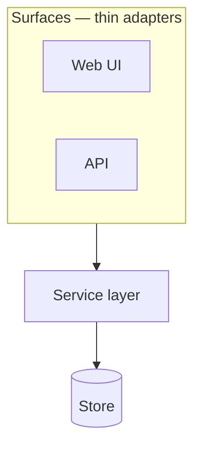

# <Project> — Architecture

**Status:** EVOLVES — provisional parts marked; decisions referenced by ID, never restated
**Version:** 0.1 · **Last updated:** <YYYY-MM-DD>
**Decisions:** D-n in `04-decision-log.md`

> **Rule for this document:** it describes what the system *is*. It does not argue.
> Every choice that could have gone another way lives in the decision log with a status;
> here it appears as a reference — "the primary datastore is <X> (D1, PROVISIONAL)".
> That split is what keeps this doc readable while decisions churn underneath it.
>
> **Three parts, and only the last two are yours to write.** *Given* is what adopting the KIT
> fixed, stated as references to where the KIT says it and not as questions; a given part is
> not edited, and changing one leaves the certified pair (this KIT commit with the template
> commit `bb health` ran it against). *Chosen* is what this project decides once, in
> Foundation, and records in the decision log. *Theirs* is the domain. Delete this note.

---

# Part 1 — Given: fixed by adopting the KIT

## 1. The stack, as pinned

The application was generated by `bb init` from the KIT's pinned template
(`harness/resources/template-pins.edn` names the commit and its tag; `03-method-and-tooling.md`
§18 records the pair this project was generated from). It is **Integrant + Reitit + Ring/Jetty +
Hiccup**, server-rendered, with **HTMX 2 / Alpine 3 / Tailwind 4** on the page; **Malli** for
shapes; **next.jdbc + HoneySQL + Ragtime** against SQLite or Postgres; clj-kondo, cljfmt and
eftest + cloverage as gates 1–3; a headless `:nrepl` alias; `bb serve`. This is not a selection
this document makes, so it is not a row in §13's table with a status: `method.md` §03 step 1 is
where the KIT says it, and the template's own README is where it is described.

## 2. The layering, as `layers.edn` declares it

`<name>-app/layers.edn` is the template's require graph at the pinned commit, written by `bb init`
and enforced by the boundary gate (gate 4, the `:deps` gate in the plan's `loop.edn`) from the
first commit. Names are tails under the application's root namespace:

| Layer | May require |
|---|---|
| `core` | — |
| `db` | — |
| `views` | — |
| `handlers` | `views` |
| `routes` | `handlers` |
| `server` | `handlers` `routes` |

Two rules the gate enforces and this document does not restate: a namespace under `src/` absent
from the map fails the gate (declare a layer, do not discover it), and an entry with no file fails
it too. Across a seam, depend on a protocol, never on an implementation; the composition root is
the one namespace allowed both sides. What this project ADDS to the graph is §4.

## 3. The system's shape

One process: Ring/Jetty serving Reitit routes, handlers rendering Hiccup, a store behind a
protocol, wired by Integrant, with the REPL inside it. Every project built on the KIT starts from
this shape; §7's diagram is what this project makes of it.

---

# Part 2 — Chosen: decided once, in Foundation, recorded in the log

## 4. Layers above the template's

> Every layer this project adds - a domain model, a service layer, an ingestion path - is one
> row here AND one entry in `<name>-app/layers.edn`, in the same change, with the decision that
> introduced it. The template's six are in §2 and are not repeated. The direction of the whole
> graph is also the `:layer-boundaries` rule in `<name>-plan/rules.edn`, where every role reads it.
> No dispatched role writes `layers.edn`: the Architect puts the edited file in the run directory's
> `arch/` and names it in the run's `loop.edn` as `:architecture {:from "arch" :files ["layers.edn"]}`;
> assembly copies it into the gate worktree beside the roles' files, so the entry and the namespace
> it declares meet the boundary gate together and are merged together.

| Layer | Namespace | May depend on | Decision |
|---|---|---|---|
| `<model>` | `<app>.model` | — | D-n |
| `<service>` | `<app>.service` | `<store>` `<model>` | D-n |

## 5. The seams

> The protocols that make modules swappable. Each one is a contract, and each is the
> reason a PROVISIONAL decision can have a real fallback rather than a hoped-for one.

| Seam | Protocol | Separates | Fallback behind it | What everything past it may ASSUME |
|---|---|---|---|---|
| Storage | `<Store>` | service ↔ persistence | <named fallback> | <e.g. every record valid against its shape; ids distinct> |

> The last column is the one that gets forgotten, and it is the expensive one. What a seam
> establishes — validated here and nowhere else, distinct ids, exactly one of something — is
> invisible to every role past it unless it is written where they read: a role handed a bare
> vector reads the shapes, finds nothing forbidding the bad input, and is right to object. Copy
> this column into the `:data-conventions` rule of `<name>-plan/rules.edn`
> (`03-method-and-tooling.md` §11).
> A seam is not only where data enters: a value handed INTO a function crosses one too. If a
> function's targets only hold for arguments its callers never pass — a tree that carries none of
> the function's own markers, say — that is a guarantee, and it goes in this column.

## 6. The datastore

> The template's default is SQLite through next.jdbc; Postgres is the same code under a
> different URL; XTDB v2 is the third option in the same slot, and `method.md` §03 step 1a says
> what changes. Which one, its status (RESOLVED, or PROVISIONAL with the spike that gates it),
> the fallback behind the store protocol, and the migration story. The store is behind a protocol
> from the first commit whichever you pick - that is what makes the fallback real.

**Store:** <selection> (D-n, <RESOLVED | PROVISIONAL, gated by R-n>) — fallback: <x> —
migrations: <Ragtime as shipped | optional under XTDB>

---

# Part 3 — Theirs: the domain

## 7. System overview

> One diagram and one paragraph. Layers, and what flows between them.

## 8. Versioning / temporality

## 9. Ingestion / input path

## 10. Query & read model

## 11. Surfaces (UI, API)

## 12. Cross-cutting concerns

> Authn/authz · configuration & secrets · logging, metrics, tracing · error handling ·
> background/async job model (anything not credibly synchronous) · deployment topology.

## 13. Technology summary

> The given rows are filled; they carry no status because they are not decisions. The chosen
> rows reference the log.

| Concern | Selection | Status |
|---|---|---|
| Language / runtime | Clojure on JDK 21 | given |
| Scaffold | the KIT's pinned template, `<tag>` at `<commit>` (`bb init` printed both) | given |
| Web / routing / templating | Reitit + Ring/Jetty + Hiccup; HTMX 2 / Alpine 3 / Tailwind 4 | given |
| Datastore | <selection> | <status> (D-n) — fallback: <x> |
| Deployment | <selection> | <status> (D-n) |
