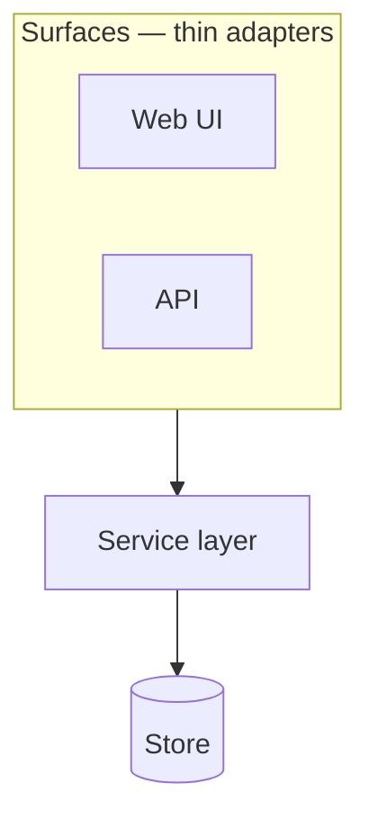

# <Project> — Architecture

**Status:** EVOLVES — provisional parts marked; decisions referenced by ID, never restated
**Version:** 0.1 · **Last updated:** <YYYY-MM-DD>
**Decisions:** D-n in `04-decision-log.md`

> **Rule for this document:** it describes what the system *is*. It does not argue.
> Every choice that could have gone another way lives in the decision log with a status;
> here it appears as a reference — "the primary datastore is <X> (D1, PROVISIONAL)".
> That split is what keeps this doc readable while decisions churn underneath it.
>
> **Three parts, and only the last two are yours to write.** *Given* is what adopting the KIT
> fixed, stated as references to where the KIT says it and not as questions; a given part is
> not edited, and changing one leaves the certified pair (this KIT commit with the template
> commit `bb health` ran it against). *Chosen* is what this project decides once, in
> Foundation, and records in the decision log. *Theirs* is the domain. Delete this note.

---

# Part 1 — Given: fixed by adopting the KIT

## 1. The stack, as pinned

The application was generated by `bb init` from the KIT's pinned template
(`harness/resources/template-pins.edn` names the commit and its tag; `03-method-and-tooling.md`
§18 records the pair this project was generated from). It is **Integrant + Reitit + Ring/Jetty +
Hiccup**, server-rendered, with **HTMX 2 / Alpine 3 / Tailwind 4** on the page; **Malli** for
shapes; **next.jdbc + HoneySQL + Ragtime** against SQLite or Postgres; clj-kondo, cljfmt and
eftest + cloverage as gates 1–3; a headless `:nrepl` alias; `bb serve`. This is not a selection
this document makes, so it is not a row in §16's table with a status: `method.md` §03 step 1 is
where the KIT says it, and the template's own README is where it is described.

## 2. The layering, as `layers.edn` declares it

`<name>-app/layers.edn` is the template's require graph at the pinned commit, written by `bb init`
and enforced by the boundary gate (gate 4, the `:deps` gate in the plan's `loop.edn`) from the
first commit. Names are tails under the application's root namespace:

| Layer | May require |
|---|---|
| `core` | — |
| `db` | — |
| `views` | — |
| `handlers` | `views` |
| `routes` | `handlers` |
| `server` | `handlers` `routes` |

Two rules the gate enforces and this document does not restate: a namespace under `src/` absent
from the map fails the gate (declare a layer, do not discover it), and an entry with no file fails
it too. Across a seam, depend on a protocol, never on an implementation; the composition root is
the one namespace allowed both sides. What this project ADDS to the graph is §5.

## 3. The system's shape

One process: Ring/Jetty serving Reitit routes, handlers rendering Hiccup, a store behind a
protocol, wired by Integrant, with the REPL inside it. Every project built on the KIT starts from
this shape; §9's diagram is what this project makes of it.

## 4. Security, as the template gives it

As of the pin `kit-v1.2`. Each line names the generated application's file - under its
namespace folder in `src/`, or under `resources/` - and the function or key that does it; each was
read in the template's source and tried with curl against an application generated from it.
What the template does not do is the list after the table: §8 is where this project decides which
of it matters, and §15 where each threat is answered.

| Concern | What the application does | Where |
|---|---|---|
| Sessions | An encrypted cookie store (AES, with an HMAC), keyed from the session secret; the cookie `HttpOnly`, `SameSite=Lax`, and `Secure` under the `:prod` profile | `server.clj` `ring-handler` (`wrap-session`); `config.edn` `:cookie-attrs-secure?` |
| The session secret | Under `:prod`, read from `SESSION_SECRET_KEY`, and without it the application refuses to start; the other profiles use a fixed test key | `config.edn` `:session-secret-key`; `server.clj` `ig/assert-key` |
| CSRF | Every request but GET, HEAD and OPTIONS carries the anti-forgery token - a form's `__anti-forgery-token` field or an `X-CSRF-Token` header - or is refused with 403; `reitit-extras.core/csrf-token-html` and `csrf-token-json` write it into a page | `server.clj` `ring-handler` (`wrap-anti-forgery`) |
| Headers | On every response the application makes, a page not found, a static file and an error page included: `X-Content-Type-Options: nosniff`, `X-Frame-Options: SAMEORIGIN`, `Strict-Transport-Security` (a year, subdomains), `X-XSS-Protection: 0`, `Referrer-Policy: strict-origin-when-cross-origin` | `server.clj` `ring-handler` (the handler-wide `:middleware`), `wrap-referrer-policy` |
| Errors | A handler that throws, a response that fails its coercion and a request body that fails to decode answer the error page (500, 400) and nothing of the error; the log has the exception with the request's method and path | `server.clj` `exception-middleware`, first of the route middleware |
| SQL | Queries are HoneySQL data, formatted with every value a parameter and every identifier quoted; a raw SQL string or `[:raw …]` is outside that. Migrations are Ragtime's SQL files | `db.clj` `exec!`, `exec-one!`; `resources/migrations/` |
| Static files | Served from `resources/public/` under `/assets/`, with no directory listing and no path out of the folder; cached for a year under `:prod` | `server.clj` `ring-handler` (`create-resource-handler-cached`); `config.edn` `:cache-assets?` |
| HTML | Hiccup 2 escapes every string it renders; `hiccup2.core/raw` is the way past it | `handlers.clj`, through `reitit-extras.core/render-html` |
| Dependencies | No published advisory for any library on the runtime classpath on the day the pin was made; Jetty and Jackson are pinned over the versions Ring and jsonista bring, which lagged their fixes | `deps.edn`, the block after `ragtime` |

Not given:

- **No `Content-Security-Policy`.** The shipped Alpine build needs `'unsafe-eval'` and htmx
  injects inline styles, so any policy is a choice, and §8 makes it.
- **No session expiry on the server.** A session lasts until the browser closes, and a copied
  cookie is good until the secret changes.
- **No accounts.** The KIT generates none.
- **An htmx request that is not a GET needs the token added**, as a header from
  `csrf-token-json` on the page; the base view does not add it.
- **No redirect from HTTP to HTTPS in the application.** The Kamal deploy the template ships puts
  TLS in its proxy (`.kamal/deploy.yml`, `proxy`); another host decides it in §8.
- **The `Server` header names Jetty and its version**, and the application's image runs as root
  on the JRE base its `Dockerfile` pins.
- **A request Jetty refuses before the application** - a malformed path, a `..` or an escaped
  one - gets Jetty's own 400 page, which carries none of the headers above and names Jetty's
  version; nothing of the application is in it, and no link leads to it.
- **No request size limit and no rate limit** is set in the template's code; what Jetty and Ring
  do by default is not stated here.
- **No dependency stays clean.** An advisory is published against a version after it ships, and
  the pins above hold Jetty and Jackson where they are even when Ring or jsonista move on; the
  security pack's `deps` scan, run at every stage's end, is what says when a version must move.

---

# Part 2 — Chosen: decided once, in Foundation, recorded in the log

## 5. Layers above the template's

> Every layer this project adds - a domain model, a service layer, an ingestion path - is one
> row here AND one entry in `<name>-app/layers.edn`, in the same change, with the decision that
> introduced it. The template's six are in §2 and are not repeated. The direction of the whole
> graph is also the `:layer-boundaries` rule in `<name>-plan/rules.edn`, where every role reads it.
> No dispatched role writes `layers.edn`: the Architect puts the edited file in the run directory's
> `arch/` and names it in the run's `loop.edn` as `:architecture {:from "arch" :files ["layers.edn"]}`;
> assembly copies it into the gate worktree beside the roles' files, so the entry and the namespace
> it declares meet the boundary gate together and are merged together.

| Layer | Namespace | May depend on | Decision |
|---|---|---|---|
| `<model>` | `<app>.model` | — | D-n |
| `<service>` | `<app>.service` | `<store>` `<model>` | D-n |

## 6. The seams

> The protocols that make modules swappable. Each one is a contract, and each is the
> reason a PROVISIONAL decision can have a real fallback rather than a hoped-for one.

| Seam | Protocol | Separates | Fallback behind it | What everything past it may ASSUME |
|---|---|---|---|---|
| Storage | `<Store>` | service ↔ persistence | <named fallback> | <e.g. every record valid against its shape; ids distinct> |

> The last column is the one that gets forgotten, and it is the expensive one. What a seam
> establishes — validated here and nowhere else, distinct ids, exactly one of something — is
> invisible to every role past it unless it is written where they read: a role handed a bare
> vector reads the shapes, finds nothing forbidding the bad input, and is right to object. Copy
> this column into the `:data-conventions` rule of `<name>-plan/rules.edn`
> (`03-method-and-tooling.md` §11).
> A seam is not only where data enters: a value handed INTO a function crosses one too. If a
> function's targets only hold for arguments its callers never pass — a tree that carries none of
> the function's own markers, say — that is a guarantee, and it goes in this column.

## 7. The datastore

> The template's default is SQLite through next.jdbc; Postgres is the same code under a
> different URL; XTDB v2 is the third option in the same slot, and `method.md` §03 step 1a says
> what changes. Which one, its status (RESOLVED, or PROVISIONAL with the spike that gates it),
> the fallback behind the store protocol, and the migration story. The store is behind a protocol
> from the first commit whichever you pick - that is what makes the fallback real.

**Store:** <selection> (D-n, <RESOLVED | PROVISIONAL, gated by R-n>) — fallback: <x> —
migrations: <Ragtime as shipped | optional under XTDB>

## 8. Security choices

> Decided once, in stage 0, each a decision in the log; together they say which of §4's "not
> given" matter to this project and what §15's threat model is about. A public site that holds
> nothing private and has no accounts answers most rows in a few words - "none", "the public,
> read-only" - and that is a decision too, written down so a later stage that adds an editor or a
> form sees that it changed one. The application never decides these by default.

| Question | This project | Decision |
|---|---|---|
| What it holds | <public content · personal data · health data · money - each kind it holds, and none it does not> | D-n |
| Who reaches it | <the public, read-only · an owner · staff - and who writes> | D-n |
| The auth model | <none · a shared secret · accounts: who creates them, how long a session lasts> | D-n |
| Where it is deployed | <the host, and where TLS ends - the application or a proxy in front of it> | D-n |
| Content-Security-Policy | <none yet, and the stage that adds it · the policy> | D-n |

---

# Part 3 — Theirs: the domain

## 9. System overview

> One diagram and one paragraph. Layers, and what flows between them.

## 10. Versioning / temporality

## 11. Ingestion / input path

## 12. Query & read model

## 13. Surfaces (UI, API)

## 14. Cross-cutting concerns

> Configuration & secrets · logging, metrics, tracing · error handling · background/async job
> model (anything not credibly synchronous) · deployment topology. Authn/authz is §8.

## 15. Threat model

> What is worth protecting, who might come for it, and one line per threat with its answer:
> a line of §4 that already answers it, a decision, or the stage that will. Written in stage 0
> from §8, and revised at a stage's end when the stage changed what the application holds or who
> reaches it. The pre-release stage's exit criterion is every line here answered. A public
> brochure site's is three lines, and that is the right length for it; a site with accounts and
> personal data has more, and each is a requirement in the stage that answers it.

**Assets:** <what is worth protecting - the content's integrity, the visitors' data, the owner's account, the host>

**Actors:** <who might come for it - an anonymous visitor, a bot, a signed-in user past their rights>

| # | Threat | Answer | Where |
|---|---|---|---|
| 1 | <a thing that could go wrong, in a sentence> | <what stops it> | <§4's line, D-n, or the stage> |

## 16. Technology summary

> The given rows are filled; they carry no status because they are not decisions. The chosen
> rows reference the log.

| Concern | Selection | Status |
|---|---|---|
| Language / runtime | Clojure on JDK 21 | given |
| Scaffold | the KIT's pinned template, `<tag>` at `<commit>` (`bb init` printed both) | given |
| Web / routing / templating | Reitit + Ring/Jetty + Hiccup; HTMX 2 / Alpine 3 / Tailwind 4 | given |
| Sessions, CSRF, security headers | as §4 says | given |
| Datastore | <selection> | <status> (D-n) — fallback: <x> |
| Auth model | <selection> | <status> (D-n) |
| Deployment | <selection> | <status> (D-n) |
