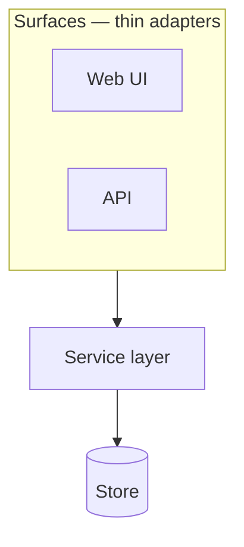

# <Project> — Architecture

**Status:** EVOLVES — provisional parts marked; decisions referenced by ID, never restated
**Version:** 0.1 · **Last updated:** <YYYY-MM-DD>
**Decisions:** D-n in `04-decision-log.md`

> **Rule for this document:** it describes what the system *is*. It does not argue.
> Every choice that could have gone another way lives in the decision log with a status;
> here it appears as a reference — "the primary datastore is <X> (D1, PROVISIONAL)".
> That split is what keeps this doc readable while decisions churn underneath it.

---

## 1. System overview

> One diagram and one paragraph. Layers, and what flows between them.

## 2. Layers and allowed dependencies

> This table becomes the boundary-gate ruleset. Write it before the layers exist.

| Layer | Namespace prefix | May depend on |
|---|---|---|
| `:model` | `app.model` | — |
| `:store` | `app.store` | `:model` |
| `:service` | `app.service` | `:store` `:model` |
| `:web` | `app.web` | `:service` `:model` |
| `:api` | `app.api` | `:service` `:model` |
| composition root | `app.system` | unlayered |

## 3. The seams

> The protocols that make modules swappable. Each one is a contract, and each is the
> reason a PROVISIONAL decision can have a real fallback rather than a hoped-for one.

| Seam | Protocol | Separates | Fallback behind it |
|---|---|---|---|
| Storage | `<Store>` | service ↔ persistence | <named fallback> |

## 4. Data layer

> Which store, its status (RESOLVED / PROVISIONAL + gating spike), what the fallback is,
> and what migration story applies.

## 5. Versioning / temporality

## 6. Ingestion / input path

## 7. Query & read model

## 8. Surfaces (UI, API)

## 9. Cross-cutting concerns

> Authn/authz · configuration & secrets · logging, metrics, tracing · error handling ·
> background/async job model (anything not credibly synchronous) · deployment topology.

## 10. Technology summary

| Concern | Selection | Status |
|---|---|---|
| Language / runtime | | |
| Scaffold | `clojure-stack-lite`, adapted | |
| Web / routing / templating | | |
| Datastore | | PROVISIONAL (D-n) — fallback: <x> |
| Deployment | | |
