# The workflow — the method as it runs on the KIT, in order

[`method.md`](method.md) says what each phase is for and why; [`harness/roster.md`](harness/roster.md)
says who acts at each step and on which model. This document is the sequence: from a conversation
about what to build to a release, which command runs when, and who stops for whom. Every box below
is either a command in the KIT's `harness/`, a document in the build repository, or a person's
decision; the diamonds are the human gates. Every stage has the same four steps - scope, plan,
implement, deploy locally - and the reviews belong to those steps, not to a place in the sequence.

```mermaid
flowchart TD
  subgraph SCOPING["Step 0 — scoping: the person and an Architect session, before anything exists"]
    Z1["the six groups of questions, and only those (method §02, step 0)"] --> Z2["the brief, written to a file"]
  end

  subgraph SETUP["Setup — the person, once"]
    S1["bb doctor"] --> S2["bb health"] --> S3["bb init xyx --brief the-brief.md"]
    S3 --> S4["xyx-app/ · xyx-build/ (docs with the brief filed, rules.edn, profile.edn, loop.edn) · work/ · workspace.edn"]
  end

  subgraph PLAN["Phase A — the plan, for stage 0: the Architect's session"]
    P1["source.md: what was read, the content named apart"] --> P2["01 requirements: the scope lists; stage 1's, no more"] --> P3["02 architecture: candidates, provisional"] --> P4["03 method"] --> P5["04 decision log: each candidate with the pass criterion stage 0 applies"] --> P6["00 overview: the stage map by kind, a cap on stage 0 alone"]
    P4 -.-> P4a["rules.edn: the three placeholders"]
    P6 --> P7["bb plan-review — the whole set read cold; findings to reviews/, resolved in the overview"]
    P7 --> P8["bb plan-check — the gate: no mark, no template line, overlay filled, given parts intact"]
    P8 --> P9{"the person approves stage 0 and sets its cap → stage-0-gates.edn"}
  end

  subgraph STAGE0["Stage 0 — the spike: Foundation, then the risks proved"]
    Z0["the stage 0 plan: the risks it proves, their pass criteria and fallbacks"] --> F1["profile.edn edited · bb profile"] --> F2["bb rules-sync → xyx-app/AGENTS.md"] --> F3["gates as loop.edn names them"]
    F3 --> F4["stage 0's first packet through the loop with real models — the machine proved"]
    F4 --> F5["the spike's packets: each pass criterion answered, pass or fallback; running software"]
    F5 --> F6["readiness checklist closed against live evidence; what is kept, said; decisions settled"]
  end

  subgraph STAGE["A stage from 1 on — pulled when the last one ends: scope ▶ plan ▶ implement ▶ deploy locally"]
    C0["scope: the previous stage's §12 and 05-lessons.md read first; the scope lists revised"] --> C1["the stage plan, just in time: the requirements it adds, its exit criteria, its cap"]
    C1 --> C1r["bb plan-review — the stage plan and what it revised, read cold"]
    C1r --> C1g{"the person approves the stage with its cap → stage-N-gates.edn"}
    C1g --> C2["the blueprint: shapes → interfaces → namespaces → packets of ten to twenty targets"]
    C2 --> C3["bb blueprint-review — one model call: over-engineered? shapes and targets per §06; findings to reviews/&lt;stage&gt;/"]
    C3 --> C4{"sign-off — the human gate → stage-N-gates.edn"}
    C4 --> C5["per packet, in dependency order: bb spec-from-blueprint → spec.edn → bb sigs"]
    C6["deploy locally: served from a clean checkout; the browser pack; the owner's walk; the exit criteria"]
    C6 --> C7{"the person closes the stage → stage-N-gates.edn; the lessons, the index, the scope lists, the stage map"}
  end

  subgraph LOOP["the loop, per task — bb run-loop"]
    L1["start: plan-check once per workspace, then the spec review"] --> L2{"Architect reads the findings, amends or continues"}
    L2 --> L3["provision three worktrees and nREPLs; dispatch Coder and Tester"]
    L3 --> L4["assemble → gate 0 → gates"]
    L4 -- red --> L5["triage (orchestrator) → retry, or a stop"]
    L5 --> L4
    L4 -- green --> L6["code review (Reviewer)"]
    L6 -- reject --> L5
    L6 -- approve --> L7{"the person merges; record → xyx-build/runs/, RUNS.md"}
  end

  subgraph RELEASE["pre-release stages, then release — stages like any other"]
    R1["pre-release: what release needs and nothing earlier; the deploy path rehearsed on a throwaway host"] --> R2["release: package → deploy on the server, or publish for download; started as packaged on an empty home; the previous release's data opened"]
  end

  Z2 --> S1
  S4 --> P1
  P9 --> Z0
  F6 --> C0
  C5 --> L1
  F4 --> L1
  L7 --> C6
  C7 -- the next increment --> C0
  C7 -- what release needs --> R1
  R2 -- the next increment --> C0
```

## The steps, and what each produces

Steps 2 to 6 are stage 0's, once; steps 7 to 14 are every stage from 1 on - the increments, the
pre-release stages, the release. The numbers say the order inside a pass, not that a step happens
once.

| # | Step | Who | The question it answers | What runs | What exists afterwards |
|---|---|---|---|---|---|
| 0 | Scoping | the person, with an Architect session | Who is it for, what does it show or do, what material exists and which part is content, what must be proved early, what is the first thing worth seeing, what is the money? | — | the brief, in a file: the six groups' answers as given (`method.md` §02, step 0) |
| 1 | Setup | the person | Can this machine run the KIT, and where does the project live? | `bb doctor`, `bb health`, `bb init <name> --brief <file>` | the workspace: the application (two commits), the build repository (the documents with the brief filed as `source.md`'s first row and Appendix A, the rules overlay, the profile, run defaults), `work/`, `workspace.edn` with the KIT's commit |
| 2 | The plan, for stage 0 | the Architect's session | What are we building, from what evidence, which risks does stage 0 prove and against what criteria, and what have we deliberately not decided yet? | — | the seven documents, in order, `source.md` first and `05-lessons.md` empty: the scope lists; stage 1's requirements and no more; the candidate architecture as provisional decisions, each with a pass criterion; the stage map by kind, a cap on stage 0 alone; the overlay's three placeholders filled with the method document |
| 3 | The plan review | `bb plan-review` | Where does the plan contradict itself, decide too early, write a requirement for a stage not pulled, or leave a risk with no owning stage? | one call to the profile's `:plan-reviewer` with `method.md` §02's checklist | findings in `reviews/plan-review.edn`, each resolved in the overview's findings table |
| 4 | The plan check | `bb plan-check` | Is anything of the template still standing, does every requirement cite an observation or say it is inferred, and are the given parts intact? | mechanical | exit 0, or the list of what still stands; then the inferred requirements, for the approval, and the observations nothing cites, for the stage's end |
| 5 | Approval, for stage 0 | the person | Do we run the spike, and for how much? | — | stage 0 approved with its cap, recorded in `stages/stage-0-gates.edn` |
| 6 | Stage 0 | the Architect's session | Does the machine work here, with these models, and do the foundational choices hold against their pass criteria? | the stage 0 plan from its template; `bb profile`, `bb rules-sync`, the gates; the spike's packets through the loop, the first of them the machine's proving run | Foundation built and its readiness checklist closed against a live run; every pass criterion answered, pass or fallback, in the decision log; running software; what is kept, said; stage 0's section of `05-lessons.md` |
| 7 | The stage plan | the Architect's session | What and why, for this stage: its kind, the requirements it adds, the risks it retires, what it proves and shows and deliberately does not, the seams, the exit criteria, its cap, and a dependency-ordered task list | `bb plan-review` over the stage plan and the documents it revised | `docs/stages/stage-N-<name>.md`, written with the previous stage's §12 and the lessons read first, reviewed cold, approved by the person with its cap in `stage-N-gates.edn` |
| 8 | The blueprint | the Architect's session | How, precisely enough for two agents who never compare notes: which shapes, which signatures, which namespaces, which packets in which order? | — | `docs/stages/stage-N-blueprint.md`: shapes, interfaces, namespaces, packets of ten to twenty targets |
| 9 | The blueprint review | `bb blueprint-review` | Is it over-engineered? Do its shapes and targets follow §06's rules? Does it match its stage plan? | one call to the profile's `:blueprint-reviewer` with the stage plan, the blueprint and the method's two sections | findings in `reviews/<stage>/blueprint-review.edn`, each resolved in the stage plan |
| 10 | Sign-off | the person | Do these packets dispatch as written? | — | the blueprint signed, recorded in `stage-N-gates.edn`; packets may dispatch |
| 11 | A packet | `bb spec-from-blueprint`, `bb sigs` | What exactly does this task's Coder and Tester receive, and do its signatures match the source they name? | the packet pulled out of the blueprint, §1's shapes inlined, its signatures checked | `spec.edn` in the run directory |
| 12 | The loop | `bb run-loop start` and its steps | Can a contract be read two ways? Does the code satisfy it? Does the review approve? If not, whose problem is it? | plan-check once; the spec review; provisioning; dispatch; gate 0; the gates; triage; the code review | a run stopped at `:awaiting-merge`, or stopped for a person with the owner named |
| 13 | The merge | the person | Do the bytes the gates passed and the Reviewer read go in? | `bb run-loop merge`, `record` | the gate worktree merged; the record in `<name>-build/runs/`, its tables in `RUNS.md` |
| 14 | The stage's end | the Architect's session, then the person | Is it deployed locally and do the exit criteria hold, in a browser and not only in the gates; what did this stage teach the plan; and what is pulled next? | served from a clean checkout; the browser pack; the owner's walk | the exit criteria checked and the stage closed in `stage-N-gates.edn`; the stage's section of `05-lessons.md`, each lesson ending as a rule, a line in the next stage plan, or a decision; the requirements indexed; the scope lists revised against the source; the stage map re-ranked; the next stage pulled by kind - an increment, a pre-release stage, or the release - and, at the first boundary where "could we ship?" is yes, the MVP named |

## The reviews, by the step of a stage they belong to

Four readings, four reviewer roles, in every stage from 0 to the last pre-release stage; the
release runs the first two. The plan reviewer is the spec reviewer's selection in the shipped
profiles - the two readings differ in the checklist sent, not in the kind of reader - and a role
of its own so a project can set it apart.

| Review | In the stage's step | Reads | Role in the profile | Gate or reading |
|---|---|---|---|---|
| plan review, `bb plan-review` | plan | the stage plan and the documents it revised, cold; in stage 0 the whole set | `:plan-reviewer` | a reading; `bb plan-check` is the gate |
| blueprint review, `bb blueprint-review` | plan | the stage's blueprint whole, with its stage plan | `:blueprint-reviewer` | a reading; the person's sign-off is the gate |
| spec review, inside `bb run-loop start` | implement, per packet | one packet's contract, cold | `:spec-reviewer` | a stop if a target can be read two ways |
| code review, inside the loop | implement, per packet | the diff and the gate report of green code | `:reviewer` | a stop on rejection; triage names the owner |

## Three things the diagram says that prose tends to lose

- **Four model readings of words, and none is a gate.** The plan review reads the plan in every
  stage's plan step, the blueprint review reads each stage's blueprint whole before sign-off, and
  the spec review reads every packet before it dispatches; each is a reading, and a reading that
  found nothing proves nothing. The one gate on the plan is `bb plan-check`, free and mechanical,
  and `start` refuses the first dispatch until it passes.
- **Stage 0's first packet is the machine's proving run, and stage 0 owes decisions, not code.**
  A spike's packets are real questions with pass criteria written before they run; what passed is
  kept, the rest is rewritten by stage 1 with no obligation. A rehearsal on a trivial task is still
  an option, torn down and never merged: two projects merged theirs and one paid a run to clean up
  after it.
- **Every stop names its owner, and every human gate is a record.** The loop decides what it can
  and hands the rest to a person with the run left where it stopped. The Architect owns the spec
  review's findings and any stop triage routes `architect`; the person owns the merge, the money
  and a `tooling` stop. A stage's approval with its cap, its blueprint's sign-off and its close are
  dated entries in `stages/stage-N-gates.edn`, the way a merge decision is a file.

Every step above has something behind it. The last to get one was the blueprint review, which the
method promised and nothing ran until `bb blueprint-review` (register row 70, closed 2026-09-25).

Beside the workflow, not in it: `bb bake-off`, which compares candidates for any of the three
reading acts on what a build already has on disk, so the model behind a step is chosen from a
measurement rather than a preference. It runs when a person wants to choose, not at any step.
