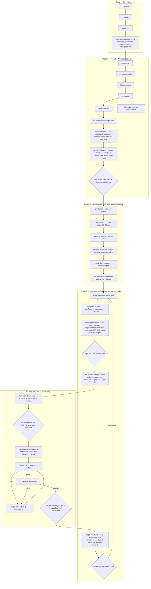

# The workflow — the method as it runs on the KIT, in order

[`method.md`](method.md) says what each phase is for and why; [`harness/roster.md`](harness/roster.md)
says who acts at each step and on which model. This document is the sequence: from a machine with
nothing on it to a stage's end, which command runs when, and who stops for whom. Every box below is
either a command in the KIT's `harness/`, a document in the plan, or a person's decision; the
diamonds are the human gates.

## The steps, and what each produces

| # | Step | Who | The question it answers | What runs | What exists afterwards |
|---|---|---|---|---|---|
| 1 | Setup | the person | Can this machine run the KIT, and where does the project live? | `bb doctor`, `bb health`, `bb init <name>` | the workspace: the application (two commits), the plan (documents, the rules overlay, the profile, run defaults), `work/`, `workspace.edn` |
| 2 | The plan | the Architect's session | What are we building, from what evidence, and what have we deliberately not decided yet? | — | the six documents, in order, `source.md` first; the overlay's three placeholders filled with the method document |
| 3 | The plan review | `bb plan-review` | Where does the plan contradict itself, decide too early, or leave a hole with no owner? | one call to the profile's `:spec-reviewer` with `method.md` §02's checklist | findings in `reviews/plan-review.edn`, each resolved in the overview's findings table |
| 4 | The plan check | `bb plan-check` | Is anything of the template still standing, and are the given parts intact? | mechanical | exit 0, or the list of what still stands |
| 5 | Approval | the person | Do we build this, and for how much? | — | the plan approved once; the cap set |
| 6 | Foundation | the Architect's session | Does the machine work here, with these models, before anything real goes through it? | `bb profile`, `bb rules-sync`, the gates, one trivial run `w0` | the loop proved with real models; the record kept, the run torn down; the readiness checklist closed |
| 7 | The stage document | the Architect's session | What and why: the goal, the risks this stage retires, what it proves and deliberately does not, the seams, the exit criteria, and a dependency-ordered task list | — | `docs/stages/stage-N-<name>.md`: goal, decisions exercised, the seams, exit criteria, a dependency-ordered task list |
| 8 | The Blueprint | the Architect's session | How, precisely enough for two agents who never compare notes: which shapes, which signatures, which namespaces, which packets in which order? | — | `docs/stages/stage-N-blueprint.md`: shapes, interfaces, namespaces, packets |
| 9 | The Blueprint review | `bb blueprint-review` | Is it over-engineered? Do its shapes and targets follow §06's rules? Does it match its stage document? | one call to the profile's `:blueprint-reviewer` with the stage document, the Blueprint and the method's two sections | findings in `reviews/<stage>/blueprint-review.edn`, each resolved in the stage document |
| 10 | Sign-off | the person | Do these packets dispatch as written? | — | the Blueprint's status changes; packets may dispatch |
| 11 | A packet | `bb spec-from-blueprint`, `bb sigs` | What exactly does this task's Coder and Tester receive, and do its signatures match the source they name? | the packet pulled out of the Blueprint, §1's shapes inlined, its signatures checked | `spec.edn` in the run directory |
| 12 | The loop | `bb run-loop start` and its steps | Can a contract be read two ways? Does the code satisfy it? Does the review approve? If not, whose problem is it? | plan-check once; the spec review; provisioning; dispatch; gate 0; the gates; triage; the code review | a run stopped at `:awaiting-merge`, or stopped for a person with the owner named |
| 13 | The merge | the person | Do the bytes the gates passed and the Reviewer read go in? | `bb run-loop merge`, `record` | the gate worktree merged; the record in `<name>-plan/runs/`, its tables in `RUNS.md` |
| 14 | The stage's end | the Architect's session, then the person | Are the exit criteria met, in a browser and not only in the gates, and what did this stage teach the plan? | build, serve, screenshots, the interaction check | exit criteria checked; the decision log and the overview revised; the next stage pulled |

## Three things the diagram says that prose tends to lose

- **Three model readings of words, and none is a gate.** `bb plan-review` reads the plan once,
  `bb blueprint-review` reads each stage's Blueprint whole before sign-off, and the spec review reads
  every packet before it dispatches; each is a reading, and a reading that found nothing proves
  nothing. The one gate on the plan is `bb plan-check`, free and mechanical, and `start` refuses the
  first dispatch until it passes.
- **Foundation's run is torn down, never merged.** `w0` proves the machine; nothing of it belongs in
  the application. Two projects merged theirs and one paid a run to clean up after it.
- **Every stop names its owner.** The loop decides what it can and hands the rest to a person with
  the run left where it stopped. The Architect owns the spec review's findings and any stop triage
  routes `architect`; the person owns the merge, the money and a `tooling` stop.

Every step above has something behind it. The last to get one was the Blueprint review, which the
method promised and nothing ran until `bb blueprint-review` (register row 70, closed 2026-09-25).

Beside the workflow, not in it: `bb bake-off`, which compares candidates for any of the three
reading acts on what a build already has on disk, so the model behind a step is chosen from a
measurement rather than a preference. It runs when a person wants to choose, not at any step.
